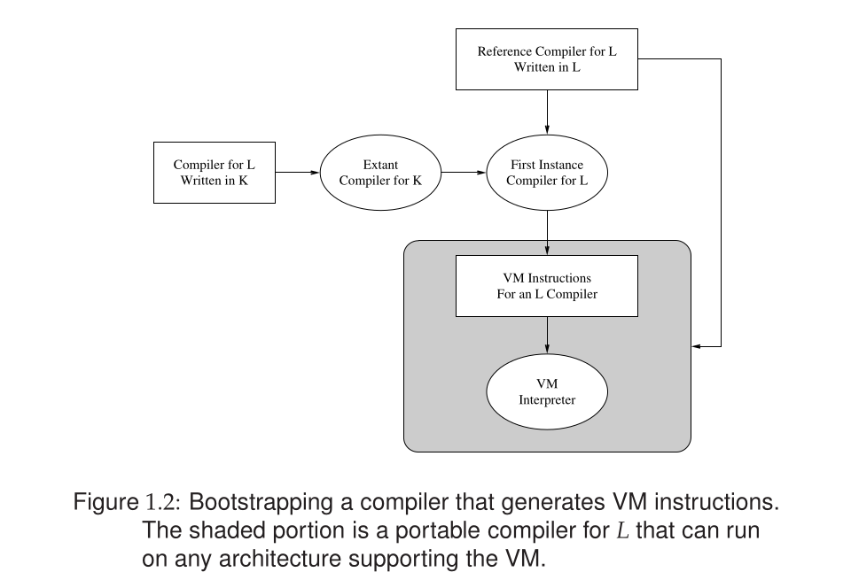
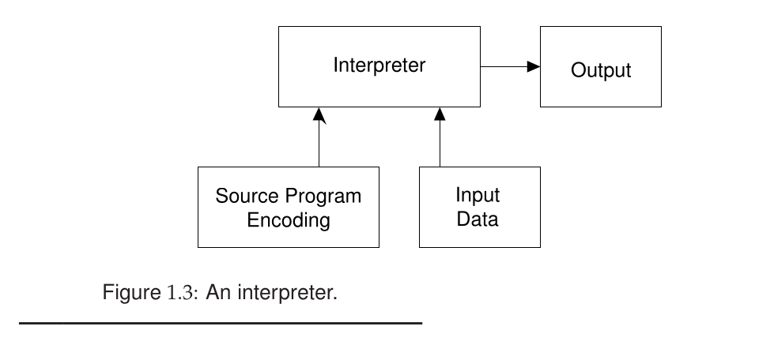
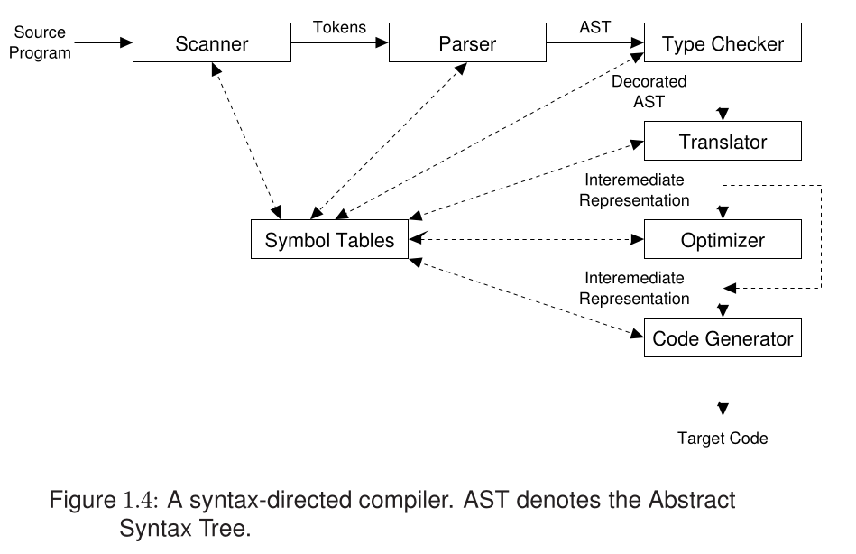

### Machine code generated by Compilers

Compilers may generate any of three types of code by which they can be differentiated.
* Pure Machine Code
    Compilers may generate code for a particular machine's instruction set without assuming the existence of any operating system or library routines. Such machines code is called **pure code**.

    This approach is rare because most compilers rely on runtime libraries and operating system calls to interface with the generated code. Pure machine code is most commonly used in compilers for system level implementation languages which are intended for implementing operating systems and embeded systems.

* Augmented Machines Code
    Far more often, compilers generate code for a machine architecture that is augmented with operating system routines and runtime language support routines. The execution of a program generated by such a compiler requires that a particular operating system be present on the target machine and a collection of language-specific runtime support routines (I/O, storage alloca-tion, mathematical functions, etc.) be available to the program. Most Fortran compilers use such software support only for I/O and mathematical functions. Other compilers assume a much larger range of available functionality. These may include data transfer instructions (such as, to move bit fields), procedure call instructions (to pass parameters, save registers, allocate stack space, etc.), and dynamic storage instructions (to provide for heap allocation).


* Virtual Machine Code
    The third type of code generated is composed entirely of virtual instructions.

    This approach is particularly attractive as a technique for producing code  that can be run easily on a variety of computers. This level of portability is achieved by writing an interpreter for the virtual machine (VM) on any target architecture of interest. Code generated by the compiler can then be run on any architecture for which a VM interpreter is available. Java is an
example of a language for which a VM (the Java Virtual Machine (JVM)
and its bytecode instructions) was defined to accompany the language. Java
applications produce predictable results on any computer for which a JVM
interpreter is available. Similarly, Java applets can be run in any web browser
provisioned with a JVM interpreter.
The advantages of portability obtained by using a VM instruction set can
also make the compiler itself easy to port. For the purposes of this discussion,
assume that the compiler accepts some source language L. Any instance of
this compiler can translate a program written in L into the VM instructions.
If the compiler itself is written in L, then the compiler can compile itself into
VM instructions, which can be executed on any architecture that hosts the VM
interpreter. If the VM is kept simple and clean, the interpreter can be relatively
easy to write. The process of porting such a compiler from one architecture
to another is called bootstrapping and is illustrated in Figure 1.2. The very
first instance of an L compiler cannot compile itself, since no such compiler
exists yet. However, the first instance can be written in a language K for which
a compiler or assembler already exists. As shown in Figure 1.2, the result
of that compilation is the first executable instance of a compiler for L. That
first instance is usually discarded after the reference compiler, written in L, is
functioning correctly.
Examples of compilers that target a VM for portability include the early
Pascal compilers and the Java compiler included in the Java Development
Kit (JDK). Pascal uses P-code [Han85], while Java uses JVM bytecodes [Gos95]
code. Both of these VMs are stack-based architectures. A rudimentary inter-
preter for P-code or JVM code can be written in a few weeks. Execution speed
is roughly five to ten times slower than that of compiled code. Alternatively,
the virtual machine code can be either translated into C code or expanded
to machine code directly. This approach made Pascal and Java available for
almost any platform. It was instrumental in Pascal’s success in the 1970s and
strongly influenced the acceptance of Java.
Virtual instructions serve a variety of purposes. They simplify the job
of a compiler by providing primitives suitable for the particular language
being translated (such as procedure calls and string manipulation). They also
contribute to compiler transportability. Furthermore, they may allow for a
significant decrease in the size of generated code because instructions can be
designed to meet the needs of a particular programming language (such as
JVM bytecodes for Java). Using this approach, one can realize as much as a
two-thirds reduction in generated program size. This can be a crucial factor
when a program is transmitted over a slow communications path (e.g., a Java
applet sent from a slow server).
When an entirely virtual instruction set is used as the target language,
the instruction set must be interpreted in software. In a just-in-time (JIT)
approach, virtual instructions can be translated to target code just as they are
about to be executed, or when they have been interpreted often enough to
merit translation into target code.
If a virtual instruction set is used often enough, it is possible to develop
special microprocessors that implement the virtual instruction set in hard-
ware. For example, JazelleTM [Jaz] offers hardware support to improve the
performance and power usage of mobile phone applications that execute JVM
instructions.
In summary, most compilers generate code that interfaces with runtime
libraries, operating system utilities, and other software components. VMs can
enhance compiler portability and increase consistency of program execution
across diverse target architectures.


### 1.2.2 Target Code Formats

Another way that compilers differ from one another is in the format of the
target code they generate. Target formats may be categorized as follows:


* **Assembly Language (Source) Format** The generation of assembly code simplifies and modularizes translation. A
number of code-generation decisions (such as instruction and data addresses)
can be left for the assembler. This approach is common for compilers de-
veloped as instructional projects or for prototyping programming language
designs. One reason for this is that the assembly code is relatively easy to scru-
tinize, which makes the compilation process more transparent for students
and prototyping activities.
Generating assembler code is also useful for cross-compilation, where
the compiler executes on one computer but generates code that executes on
another. The symbolic assembly code is easily transferred between different
computers.
Sometimes another programming language, such as C, is generated by a
compiler instead of a specific assembly language. C has in fact been called
a universal assembly language because it is relatively low level yet it is far
more platform independent than any particular assembly language. However,
generation of C code leaves many decisions (such as the runtime representation
of data structures) to a particular C compiler. Full control over such matters is
retained if a compiler generates assembly language.

* **Relocatable Binary Format**
    Most production-quality compilers do not generate assembly language; direct
generation of target code (in relocatable or absolute binary format) is more ef-
ficient and allows the compiler more control over the translation process. It is
nonetheless beneficial for the compiler’s output to be open to scrutiny. Compil-
ers that produce binary format typically can also produce a pseudoassembly
language listing of the generated code. Such a listing shows the instructions
generated by the compiler with annotations to document storage references.
Relocatable binary format is essentially the form of code that most as-
semblers generate. This format can also be generated directly by a compiler.
External references, local instruction addresses, and data addresses are not
yet bound. Instead, addresses are assigned relative either to the beginning of
the module or to some symbolically named locations. The latter alternative
makes it easy to group together code sequences or data areas. A linkage step
is required to incorporate any support libraries as well as other separately
compiled routines referenced from within a compiled program. The result is
an absolute binary format that is executable.
Both relocatable binary and assembly language formats allow modular
compilation: the decomposition of a large program into separately compiled
pieces. They also allow cross-language support: incorporation of assembler
code and code written and compiled in other high-level languages. Such code
can include I/O, storage allocation, and math libraries that supply functionality
regarded as part of the language’s definition.

* **Absolute Binary Format**
Some compilers generate an absolute binary format that can be directly ex-
ecuted when the compiler is finished. This process is usually faster than the
other approaches. However, the ability to interface with other code may be
limited. In addition, the program must be recompiled for each execution un-
less some means is provided for archiving the memory image. Compilers
that generate an absolute binary format are useful for student exercises and
prototyping use, where frequent changes are the rule and compilation costs
far exceed execution costs. It also can be useful to avoid saving compiled for-
mats to save file space or to guarantee the use of only the most current library
routines and class definitions.




### 1.3 Interpreters

Another kind of language processor is the interpreter. Interpreters share some
of the functionality found in compilers, such as syntactic and semantic analy-
ses. However, interpreters differ from compilers in that they execute programs
without explicitly performing much translation. Figure 1.3 illustrates schemat-
ically how interpreters work. To an interpreter, a program is merely data that
can be arbitrarily manipulated, just like any other data. The locus of control
during execution resides in the interpreter, not in the user program (i.e., the
user program is passive rather than active).
Interpreters provide a number of capabilities not usually found in compil-
ers, as follows:
* Programs can be easily modified as execution proceeds. This provides a
straightforward interactive debugging capability,since a program can be
modified to pause at points of interest or to display the value of program
variables. Depending on program structure, program modifications may
require reparsing or repeating semantic analysis.
* Languages in which the type of an object is developed dynamically
(e.g., Lisp and Scheme) are easily supported in an interpreter. Some
languages (such as Smalltalk and Ruby) allow the type system itself to
change dynamically. Since the user program is continuously reexamined
as execution proceeds, symbols need not have a fixed meaning. For
example, a symbol may denote an integer scalar at one point and a
Boolean array at a later point. Such fluid bindings are more problematic
for compilers, since dynamic changes in the meaning of a symbol make
direct translation into machine code more difficult.
* Interpreters provide a significant degree of machine independence, since
no machine code is generated. All operations are performed within the
interpreter. Porting an interpreter can be as simple as recompiling the
interpreter on a new machine, if the interpreter is written in a language
already supported on that machine.However, direct interpretation of source programs can involve significant over-
head. As execution proceeds, program text must be continuously reexamined.
Identifier bindings, types, and operations may have to be recomputed at each
reference. For languages where such bindings can change arbitrarily, interpre-
tation can be 100 times slower than compiled code. For more static languages
such as C and Java, the cost difference is closer to 10.
Some languages (C, C++, and Java) have both interpreters (for debug-
ging and program development) and compilers (for production work). JIT
compilers offer a combination of interpretation and compilation/execution.

In summary, all language processing involves interpretation at some level.
Interpreters directly interpret source programs or some syntactically trans-
formed versions of them. They may exploit the availability of a source repre-
sentation to allow program text to be changed as it is executed and debugged.
While a compiler has distinct translation and execution phases, some form of
“interpretation” is still involved. The translation phase may generate a virtual
machine language that is interpreted by software or a real machine language
that is interpreted by a particular computer, either in firmware or hardware.

### 1.4 Syntax and Semantics

A complete definition of a programming language must include the specifica-
tion of its syntax (structure) and its semantics (meaning).
Syntax typically means context-free syntax because of the almost universal
use of context-free grammars (CFGs) as a syntactic specification mechanism.
Syntax defines the sequences of symbols that are legal; syntactic legality is
independent of any notion of what the symbols mean. For example, a context-
free syntax might specify that a=b+c is syntactically legal, while b+c=a is not.
However, not all aspects of well-formed programs can be described by context-
free syntax. For example, CFGss cannot specify type compatibility and scoping
rules. For example, a programming language may specify that a=b+c is illegal
if any of the variables are undeclared or if b or c is of type Boolean.
Because of the limitations of CFGss, the semantics of a programming
language are commonly divided into two classes:

#### 1.4.1 Static Semantics

The static semantics of a language provide a set of rules that specify which
syntactically legal programs are actually valid. Such rules typically require that
all identifiers be declared, that operators and operands be type-compatible,
and that procedures be called with the proper number of parameters. The
common thread through all of these rules is that they cannot be expressed
with a CFGs. Thus static semantics augment context-free specifications and
complete the definition of valid programs.
Static semantics can be specified formally or informally. The prose descrip-
tions found in most programming language specifications are informal. They
tend to be relatively compact and easy to read, but often they are imprecise.
Formal specifications can be expressed using any of a variety of notations.
For example, attribute grammars [Knu68] can formalize many of the semantic
checks found in compilers. The following rewriting rule, called a production,
specifies that an expression, denoted by E, can be rewritten into an expression
E plus a term T:

```C
E→ E + T
```

In an attribute grammar, this production might be augmented with a type
attribute for E and T and a predicate testing for type compatibility, such as

```C
Eresult → Ev1 + Tv2
if v1.type = numeric and v2.type = numeric
then result.type ← numeric
else call error( )
```

Attribute grammars are a reasonable blend of formality and readability, but
they can be rather verbose and tedious. Most compiler-writing systems do
not use attribute grammars directly. Instead, they propagate semantic infor-
mation through a program’s abstract syntax tree (AST) in a manner similar
to the evaluation of attribute grammar systems. The specifics of a portion of
semantics checking are thus written in the compiler as a semantics-checking
phase. Such is the approach taken in this book.

#### 1.4.2 Runtime Semantics

Runtime, or execution, semantics are used to specify what a program com-
putes. These semantics are often specified very informally in a language man-
ual or report. Alternatively, a more formal operational, or interpreter, model can
be used. In such a model, a program “state” is defined and program execution
is described in terms of changes to that state. For example, the semantics of
the statement a = 1 is that the state component corresponding to a is changed
to 1.
A variety of formal approaches to defining the runtime semantics of pro-
gramming languages have been developed. Three of them, natural semantics,
axiomatic semantics and denotational semantics, are described below.

#### **Natural Semantics**
Natural semantics [NN92] (sometimes called structured operational seman-
tics) formalizes the operational approach. Given assertions known to be true
before the evaluations of a construct, we can infer assertions that will hold
after the construct’s evaluation. Natural semantics has been used to define the
semantics of a variety of languages, including standard ML [MTHM97].


#### **Axiomatic Semantics**
Axiomatic definitions [Gri81] can be used to model execution at a more ab-
stract level than operational models. They are based on formally specified
relations, or predicates, that relate program variables. Statements are defined by
how they modify these relations.
As an example of axiomatic definitions, the axiom defining var ← exp
states that a predicate involving var is true after statement execution if, and
only if, the predicate obtained by replacing all occurrences of var by exp is
true beforehand. Thus, for y > 3 to be true after execution of the statement
y ← x + 1, the predicate x + 1 > 3 would have to be true before the statement
is executed. Similarly, y = 21 is true after execution of x ← 1 if y = 21 is true
before its execution (this is a roundabout way of saying that changing x doesn’t
affect y). However, if x is an alias (an alternative name) for y, the axiom is
invalid. This is one reason why aliasing is discouraged (or forbidden) in some
language designs.
The axiomatic approach is good for deriving proofs of program correctness
because it avoids implementation details and concentrates on how relations
among variables are changed by statement execution. Although axioms can
formalize important properties of the semantics of a programming language, it
is difficult to use them to define most programming languages completely. For
example, they do not do a good job of modeling implementation considerations
such as running out of memory.

#### **Denotational Semantics**

Denotational models [Sch86] are more mathematical in form than operational
models, but they can accommodate memory stores and fetches that are central
to procedural languages. They rely on notation and terminology drawn from
mathematics, so they are often fairly compact, especially in comparison with
operational definitions.
A denotational definition may be viewed as a syntax-directed definition
that specifies the meaning of a construct in terms of the meaning of its immedi-
ate constituents. For example, to define addition, we might use the following
rule:

```C
E[T1 + T2]m = E[T1]m + E[T2]m
```
This definition says that the value obtained by adding two subexpressions,
T1 and T2, in the context of a memory state m is defined to be the sum of
the arithmetic values obtained by evaluating T1 in the context of m (denoted
E[T1]m) and T2 in the context of m (denoted E[T2]m).
Denotational techniques are quite popular and form the basis for rigorous
definitions of programming languages. Research has shown that it is possible
to convert denotational representations automatically to equivalent representa-
tions that are directly executable [Set83, Wan82, App85].

Summary Regardless of how semantics are specified, our concern for pre-
cise semantics is motivated by the fact that writing a complete and accurate
compiler for a programming language requires that the language itself be well
defined. While this assertion may seem self-evident, many languages are
defined by imprecise or informal language specifications. Attention is often
given to formal specification of syntax, but the semantics of the language may be
defined via informal prose. The resulting definition inevitably is ambiguous
or incomplete on certain points.
For example, in Java all functions must return via a return expr state-
ment, where expr is assignable to the function’s return type. The following is
therefore illegal:

```C
public static int subr(int b) {
    if (b != 0)
        return b+100;
}
```

If b is equal to zero, subr fails to return a value. Now consider the following:

```C
public static int subr(int b) {
    if (b != 0)
        return b+100;
    else if (10*b == 0)
        return 1;
}
```
In this case, a proper return is always executed, since the else part is reached
only if b equals zero; this implies that 10*b is also equal to zero. Is the
compiler expected to duplicate this rather involved chain of reasoning? Java
compilers typically assume that a predicate could evaluate to true or false,
even if a detailed program analysis refutes that assumption. Thus a compiler
may reject subr as semantically illegal and in so doing trade simplicity for
accuracy in its analysis. Indeed, the general problem of deciding whether
a particular statement in a program is reachable is undecidable, proved by
reduction from the famous halting problem [HU79]. We certainly cannot ask
our Java compiler literally to do the impossible!
In practice, a trusted reference compiler can serve as a de facto language
definition. That is, a programming language is, in effect, defined by what a
compiler chooses to accept and how it chooses to translate language constructs.
In fact, the operational and natural semantic approaches introduced previously
take this view. A standard interpreter is defined for a language, and the
meaning of a program is precisely whatever the interpreter says. An early
(and very elegant) example of an operational definition is the seminal Lisp
interpreter [McC60]. There, all of Lisp was defined in terms of the actions of
a Lisp interpreter, assuming only seven primitive functions and the notions of
argument binding and function call.
Of course, a reference compiler or interpreter is no substitute for a clear and
precise semantic definition. Nonetheless, it is very useful to have a reference
against which to test a compiler that is under development.

### 1.5 Organization of a Compiler

Almost all modern compilers are syntax-directed. That is, the compilation
process is driven by the syntactic structure of the source program, as recog-
nized by the parser. Most compilers distill the source program’s structure into
an abstract syntax tree (AST) that omits unnecessary syntactic detail. The
parser builds the AST out of tokens, the elementary symbols used to define a
programming language syntax. Recognition of syntactic structure is a major
part of the syntax analysis task.
Semantic analysis examines the meaning (semantics) of the program on
the basis of its syntactic structure. It plays a dual role. It finishes the analysis
task by performing a variety of correctness checks (for example, enforcing type
and scope rules). It also begins the synthesis phase.
In the synthesis phase, source language constructs are translated into an
intermediate representation (IR) of the program. Some compilers generate
target code directly. If an IR is generated, it then serves as input to a code genera-
tor component that actually produces the desired machine-language program.
The IR may optionally be transformed by an optimizer so that a more efficient
program may be generated. A common organization of all of these compiler
components is depicted schematically in Figure 1.4. Each of these components is described in more detail below. Chapter 2 presents a simple compiler to pro-
vide concrete examples of many of the concepts introduced in this overview.



### 1.5.1 The Scanner

The scanner begins the analysis of the source program by reading the input
text (character by character) and grouping individual characters into tokens
such as identifiers, integers, reserved words, and delimiters. This is the first
of several steps that produce successively higher-level representations of the
input. The tokens are encoded (often as integers) and fed to the parser for
syntactic analysis. When necessary, the actual character string comprising the
token is also passed along for use by the semantic phases. The scanner does
the following:
* It puts the program into a compact and uniform format (a stream of
tokens).
* It eliminates unneeded information (such as comments).
* It processes compiler control directives (for example, turn the listing on
or off and include source text from a specified file).
* It sometimes enters preliminary information into symbol tables (for ex-
ample, to register the presence of a particular label or identifier).
* It optionally formats and lists the source program.

The main action of building tokens is often driven by token descriptions.
Regular expression notation (discussed in Chapter 3) is an effective approach
to describing tokens. Regular expressions are a formal notation sufficiently
powerful to describe the variety of tokens required by modern programming
languages. In addition, they can be used as a specification for the automatic
generation of finite automata (discussed in Chapter 3) that recognize regular
sets, that is, the sets that regular expressions define. Recognition of regular sets
is the basis of the scanner generator. A scanner generator is a program that
actually produces a working scanner when given only a specification of the
tokens it is to recognize. Scanner generators are a valuable compiler-building
tool.

#### 1.5.2 The Parser

The parser is based on a formal syntax specification such as a CFGs. It reads
tokens and groups them into phrases according to the syntax specification.Parsers are typically driven by tables created from a CFGs
by a parser generator.
The parser verifies correct syntax. If a syntax error is found, it issues a
suitable error message. Also, it may be able to repair the error (to form a
syntactically valid program) or to recover from the error (to allow parsing to
be resumed). In many cases, syntactic error recovery or repair can be done
automatically by consulting structures created by a suitable parser generator.
As syntactic structure is recognized, the parser usually builds an AST as
a concise representation of program structure. The AST then serves as a basis
for semantic processing.

#### 1.5.3 The Type Checker (Semantic Analysis)

The type checker checks the static semantics of each AST node. That is, it
verifies that the construct the node represents is legal and meaningful (that
all identifiers involved are declared, that types are correct, and so on). If the
construct is semantically correct, the type checker decorates the AST node by
adding type information to it. If a semantic error is discovered, a suitable error
message is issued.
Type checking is purely dependent on the semantic rules of the source
language. It is independent of the compiler’s target.

#### 1.5.4 Translator (Program Synthesis)

If an AST node is semantically correct, it can be translated into IR code that
correctly implements the meaning of the AST node. For example, an AST for
a while loop contains two subtrees, one representing the loop’s expression and
the other representing the loop’s body. However, nothing in the AST explicitly
captures the notion that a while loop loops! This meaning is captured when a
while loop’s AST is translated to IR form. In the IR, the notion of testing the
value of the loop control expression and conditionally executing the loop body
is made explicit.
The translator is largely dictated by the semantics of the source language.
Little of the nature of the target machine needs to be made evident. As a
convenience during translation, some general aspects of the target machine
may be exploited (for example, that the machine is byte-addressable or that
it has a runtime stack). However, detailed information on the nature of the
target machine (operations available, addressing, register characteristics, etc.)
is reserved for the code-generation phase.
In simple, nonoptimizing compilers, the translator may generate target
code directly without using an explicit IR. This simplifies a compiler’s design
by removing an entire phase. However, it also makes retargeting the compiler to another machine much more difficult. Most compilers implemented as
instructional projects generate target code directly from the AST, without using
an IR.
More elaborate compilers such as the GNU Compiler Collection (GCC)
may first generate a high-level IR (that is source-language oriented) and then
subsequently translate it into a low-level IR (that is target-machine oriented).
This approach allows a cleaner separation of source and target dependencies.

#### 1.5.5 Symbol Tables

A symbol table is a mechanism that allows information to be associated with
identifiers and shared among compiler phases. Each time an identifier is
declared or used, a symbol table provides access to the information collected
about it. Symbol tables are used extensively during type checking, but they
can also be used by other compiler phases to enter, share, and later retrieve
information about types, variables, procedures, and labels. Compilers may
choose to use other structures to share information between compiler phases.
For example, a program representation such as an AST may be expanded and
refined to provide detailed information needed by optimizers, code generators,
linkers, loaders, and debuggers.

#### 1.5.6 The Optimizer

The IR code generated by the translator is analyzed and transformed into
functionally equivalent but improved IR code by the optimizer. This phase
can be complex, often involving numerous subphases, some of which may
need to be applied more than once. Most compilers allow optimizations to
be turned off so as to speed translation. Nonetheless, a carefully designed
optimizer can significantly speed program execution by simplifying, moving,
or eliminating unneeded computations.
If both a high-level and low-level IR are used, optimizations may be per-
formed in stages. For example, a simple subroutine call may be expanded into
the subroutine’s body, with actual parameters substituted for formal parame-
ters. This is a high-level optimization. Alternatively, a value already loaded
from memory may be reused. This is a low-level optimization.
Optimization can also be done after code generation. An example is peep-
hole optimization. Peephole optimization examines generated code a few
instructions at a time (in effect, through a “peephole”). Common peephole
optimizations include eliminating multiplications by 1 or additions of 0, elim-
inating a load of a value into a register when the value is already in another
register, and replacing a sequence of instructions by a single instruction with
the same effect.

#### 1.5.7 The Code Generator

The IR code produced by the translator is mapped into target machine code by
the code generator. This phase requires detailed information about the target
machine and includes machine-specific optimization such as register allocation
and code scheduling. Normally, code generators are hand-coded and can be
quite complex, since generation of good target code requires consideration of
many special cases.
The notion of automatic construction of code generators has been actively
studied. The basic approach is to match a low-level IR to target-instruction
templates, with the code generator automatically choosing instructions that
best match IR instructions. This approach localizes the target-machine specifics
of a compiler and, at least in principle, makes it easy to retarget a compiler
to a new target machine. Automatic retargeting is an especially desirable
goal, since a great deal of work is usually needed to move a compiler to a
new machine. The ability to retarget by simply changing the set of target
machine templates and generating (from the templates) a new code generator
is compelling.
A well-known compiler using these techniques is the GCC [GNU]. GCC
is a heavily optimizing compiler that can target over thirty computer architec-
R
R
, SparcTM, and PowerPC 
) and has at least six front
tures (including Intel 
ends (including C, C++, Fortran, Ada, and Java).

#### 1.5.8 Compiler Writing Tools

Finally, note that in discussing compiler design and construction, we often talk
of compiler writing tools. These are often packaged as compiler generators
or compiler compilers. Such packages usually include scanner and parser
generators. Some also include symbol table managers, attribute grammar
evaluators, and code-generation tools. More advanced packages may aid in
error repair generation.
These sorts of generators greatly assist the crafting of compilers, but much
of the effort in crafting a compiler lies in writing and debugging the semantic
phases. These routines can be numerous (a type checker and translator is
apparently needed for each distinct AST node) and are usually hand coded.
Judicious application of the visitor pattern can significantly reduce this effort
and make the compiler easier to maintain.


### Programming Language and Compiler Design

Our primary interest is the design and implementation of compilers for modern
programming languages. An interesting aspect of this study is how program-
ming language design and compiler design influence each other. Program-
ming language design obviously influences, and indeed often dictates, how
compilers are crafted. Many clever and sometimes subtle compiler techniques
arise from the need to cope with some programming language construct. A
good example of this is the closure mechanism that was invented to handle
formal procedures. A closure is a special runtime representation for a func-
tion. It is usually implemented as a pointer to the function’s body and to its
execution environment. While the concept of a closure is attractive from a
programming language design perspective, implementing closures efficiently
has been challenging for compiler writers [App92, Ken07].
The state of the art in compiler design also strongly affects programming
language design, if only because a programming language that cannot be
compiled effectively has an uphill road to acceptance. Most successful pro-
gramming language designers (such as the Java language development team)
have extensive compiler design backgrounds.
A programming language that is easy to compile usually has the following
advantages:
* It often is easier to learn, read, and understand. If a feature is hard to
compile, it may well be difficult to understand.
* It will have quality compilers on a wide variety of machines. This fact
is often crucial to a language’s success. For example, C, C++, Java, and
Fortran are widely available and very popular; Ada and Modula-3 have
limited availability and are far less popular.
* Often, better code will be generated. Poor-quality code can be fatal in
major applications.
* Fewer compiler bugs will occur. If a language cannot be easily under-
stood, then discrepancies will arise in the difficult regions of the lan-
guage’s design. These will in turn lead to compilers that differ in their
interpretation of a program’s meaning.
* The compiler will be smaller, cheaper, faster, more reliable, and more
widely used.
* Compiler diagnostic messages and program development tools will often
be better.

### 1.7 Computer Architecture and Compiler Design

Advances in computer architecture and microprocessor fabrication have spear-
headed the computer revolution. At one time, a computer offering one
megaflop performance (1,000,000 floating-point operations per second) was
considered advanced. Computers offering teraflop (one trillion flops) perfor-
mance are available and petaflop computers (one thousand trillion flops) have
become a matter of packaging (and cooling!) a sufficient number of individual
computers. Meanwhile, each individual computer is often itself a multipro-
cessor, and each processor in the computer may have multiple cores, each
offering an independent thread of control.
Compiler designers are responsible for making this vast computing capa-
bility available to programmers. Although compilers are rarely visibly to the
end users of application programs, they are an essential enabling technology.
The problems encountered in efficiently harnessing the capability of a modern
computing platforms are numerous, as follows:
*  Instruction sets for some popular architectures, particularly the Intel
x86 series, are highly nonuniform. Some operations must be done in
registers, while others can be done in memory. Often a number of
distinct register classes exist, each suitable for only a particular class
of operations.
*  High-level programming language operations are not always easy to
support. Virtual method dispatch, dynamic heap accesses, and reflec-
tive programming constructs can take hundreds or thousands of ma-
chine instructions to implement. Exceptions, threads, and concurrency
management are typically more expensive and complex to implement
than most users suspect.
* Essential architectural features such as hardware caches and distributed
processors and memory are difficult to present to programmers in an
architecturally independent manner. Yet misuse of these features can
impose immense performance penalties.
* Effective use of a large number of processors has always posed challenges
to application developers and compiler writers. Many developers have unrealistic expectations concerning how well a compiler can use large-
scale systems without changing an application. While compilers contin-
ually improve [Wol95, AK01], languages are also evolving [CGS+ 05] to
address these challenges.

For some programming languages, runtime checks for data and program in-
tegrity are dropped in favor of gains in execution speed. Programming errors
can then go undetected because of that fear that extra checking will slow
down execution unacceptably. The cost of software development and the con-
sequences of program failure have reversed that trend for most programming
efforts. A major complexity in implementing Java is efficiently enforcing the
runtime integrity constraints it imposes.

### 1.8 Compiler Design Considerations

Compilers are often biased for a particular kind of deployment or user base. In
this section we examine some common design criteria that affect how compilers
are crafted.

#### 1.8.1 Debugging (Development) Compilers

A debugging compiler such as CodeCenter [Cod] is specially designed to
aid in the development and debugging of programs. It carefully scrutinizes
programs and details programmer errors. Often it can tolerate or repair minor
errors (for example, insert a missing comma or parenthesis). Some program
errors can be detected only at runtime. Such errors include invalid subscripts,
misuse of pointers, and illegal file manipulations.
These compilers may include the checking of code that can detect run-
time errors and initiate a symbolic debugger. Although debugging compilers
are particularly useful in instructional environments, diagnostic techniques
are of value in all compilers. In the past, development compilers were used
only in the initial stages of program development. When a program neared
completion, compilation switched to a production compiler, which increased
compilation and execution speed by ignoring diagnostic concerns. This strat-
egy has been likened by Tony Hoare to wearing a life jacket in sailing classes
held on dry land, but abandoning the jacket when at sea [Hoa89]! Indeed, it is
becoming increasingly clear that for almost all applications, reliability is more
important than speed. For example, Java mandates runtime checks that C and
C++ do not.
For production systems where quality is a paramount concern, detecting
possible or actual runtime errors is crucial. Tools such as purify [pur] can
add initialization and array bounds checks to already compiled programs, thereby allowing illegal operations to be detected even when source files are
not available. Other tools such as Electric Fence [Piz99] can detect dynamic
storage problems such as buffer overruns and improperly deallocated storage.

#### 1.8.2 Optimizing Compilers

An optimizing compiler is specially designed to produce efficient target code
at the cost of increased compiler complexity and possibly increased compila-
tion times. In practice, all production-quality compilers (those whose output
will be used in everyday work) make some effort to generate reasonable target
code. For example, no add instruction would normally be generated for the
expression i+0.
The term optimizing compiler is actually a misnomer. This is because no
compiler of any sophistication can produce optimal code for all programs. The
reason for this is twofold. First, theoretical computer science has shown that
even so simple a question as whether two programs are equivalent is undecid-
able: such questions cannot generally be answered by any computer program.
Thus finding the simplest (and most efficient) translation of a program cannot
always be done. Second, many program optimizations require time propor-
tional to an exponential function of the size of the program being compiled.
Thus, optimal code, even when theoretically possible, is often infeasible in
practice.
Optimizing compilers actually use a wide variety of transformations that
improve a program’s performance. The complexity of an optimizing compiler
arises from the need to employ a variety of transforms, some of which interfere
with each other. For example, keeping frequently used variables in registers
reduces their access time but makes procedure and function calls more expen-
sive. This is because registers need to be saved across calls. Many optimizing
compilers provide a number of levels of optimization, each providing increas-
ingly greater code improvements at increasingly greater costs. The choice
of which improvements are most effective (and least expensive) is a matter
of judgment and experience.

#### 1.8.3 Retargetable Compilers

Compilers are designed for a particular programming language (the source
language) and a particular target computer (the computer for which it will generate code). Because of the wide variety of programming languages and
computers that exist, apparently a large number of similar, but not identical,
compilers must be written. While this situation has decided benefits for those
of us in the compiler writing business, it does make for a lot of duplication
of effort and for a wide variance in compiler quality. As a result, the retar-
getable compiler has become a concept of increasing importance for language
designers, computer architects, and compiler writers.
A retargetable compiler is one whose target architecture can be changed
without its machine-independent components having to be rewritten. A retar-
getable compiler is more difficult to write than an ordinary compiler because
target-machine dependencies must be carefully localized. In addition, it is
often difficult for a retargetable compiler to generate code that is as efficient as
that of an ordinary compiler because special cases and machine idiosyncrasies
are harder to exploit. Nonetheless, because a retargetable compiler allows de-
velopment costs to be shared and provides for uniformity across computers,
it is an important innovation. While discussing the fundamentals of compila-
tion, we concentrate on compilers targeted to a single machine.
