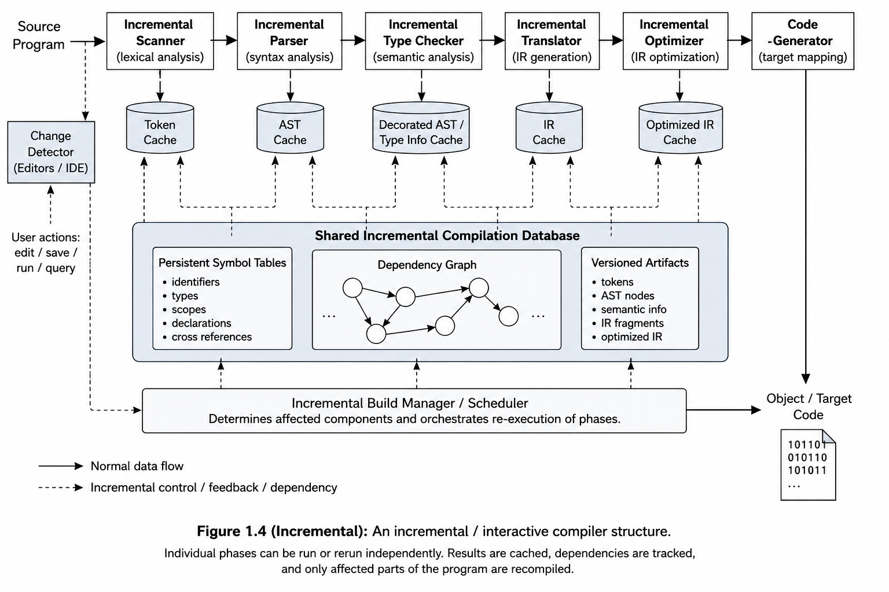

**Question No.** 1. The model of compilation we introduced is essentially batch-oriented.
In particular, it assumes that an entire source program has been written
and that the program will be fully compiled before the programmer
can execute the program or make any changes. An interesting and
important alternative is an interactive compiler. An interactive compiler,
usually part of an integrated program development environment, allows
a programmer to interactively create and modify a program, fixing errors
as they are detected. It also allows a program to be tested before it is fully
written, thereby providing for stepwise implementation and testing.
Redesign the compiler structure of Figure 1.4 to allow incremental com-
pilation. (The key idea is to allow individual phases of a compiler to be
run or rerun without necessarily doing a full compilation.)

---

### Solution:

To support incremental compilation, the compiler structure of Figure 1.4 must be redesigned from a simple linear batch-processing pipeline into a persistent, interactive, and dependency-driven system. In the redesigned architecture, each compiler phase such as scanning, parsing, type checking, translation, optimization, and code generation operates independently and stores its results in reusable caches, including token caches, AST caches, semantic information caches, and IR caches. A shared incremental compilation database maintains persistent symbol tables, dependency graphs, and versioned intermediate artifacts so that the compiler can determine which program components are affected by a source-code modification. When a programmer edits the source program, a change detector and build scheduler trigger recompilation only for the impacted regions rather than recompiling the entire program. This allows selective rescanning, reparsing, re-type-checking, reoptimization, and regeneration of machine code. Such a design significantly improves responsiveness, supports interactive development environments, enables stepwise testing during program construction, and reduces compilation overhead for large software projects.

