### 2.1 An Informal Definition of the ac Language

Our language is called ac (for adding calculator). When compared with most
programming languages, ac is relatively simple, yet it serves nicely as a study
for examining the phases and data structures of a compiler. We first define ac
informally:
* Types Most programming languages offer a significant number of predefined
data types, with the ability to extend existing types or specify new data
types. In ac, there are only two data types: **integer** and **float**. An integer
type is a sequence of decimal numerals, as found in most programming
languages. A float type allows five fractional digits after the decimal
point.

* Keywords Most programming languages have a number of reserved key-
words, such as if and while, which would otherwise serve as variable
names. In ac, there are three reserved keywords, each limited for sim-
plicity to a single letter: f (declares a float variable), i (declares an integer
variable), and p (prints the value of a variable).
Variables Some programming languages insist that a variable be declared by
specifying the variable’s type prior to using the variable’s name. 

* The ac language offers only 23 possible variable names, drawn from the
lowercase Roman alphabet and excluding the three reserved keywords
f, i, and p. Variables must be declared prior to using them.
Most programming languages have rules that dictate circumstances under
which a given type can be converted into another type. In some cases, such type
conversion is handled automatically by the compiler, while other cases require
explicit syntax (such as casts) to allow the type conversion. In ac, conversion
from integer type to float type is accomplished automatically. Conversion in
the other direction is not allowed under any circumstances.

For the target of translation, we use the widely available program dc
(for desk calculator), which is a stack-based calculator that uses reverse Polish
notation (RPN). When an ac program is translated into a dc program, the
resulting instructions must be acceptable to the dc program and must faithfully
represent the operations specified in an ac program. Stack-based languages
commonly serve as targets of translation because they lend themselves to
compact representation. Examples include the translation of JavaTM into Java
R
R
into AVM2 for Flash 
media, and
Virtual Machine (JVM), ActionScript 
R

printable documents into PostScript . Thus, compilation of ac to dc can be
viewed as a study of such larger systems.

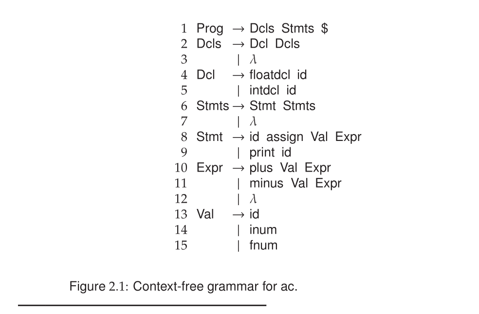

### 2.2 Formal Definition of ac

Before translating ac to dc we must first understand the syntax and semantics
of the ac language. The informal definitions above may generally describe ac,
but they are too vague to serve as a formal definition. We therefore follow
the example of most programming languages and use a context-free gram-
mar (CFG) to specify our language’s syntax and regular expressions to specify
the basic symbols of the language.

#### 2.2.1 Syntax Specification

We presently view a CFG
simply as a set of productions or rewriting rules. A CFG for the ac language
is given in Figure 2.1. To improve readability, multiple productions for the
same symbol can be specified using an arrow for the first production and bar
symbols to separate the rest of the productions. For example, Stmt serves the
same role in each of the productions:
```C
Stmt → id assign Val Expr
| print id
```
These productions indicate that a Stmt can be replaced by one of two strings
of symbols. In the first rule, Stmt is rewritten by symbols that represent assignment to an identifier. In the second rule, Stmt is rewritten by symbols
that print an identifier’s value.

Productions reference two kinds of symbols: **terminals** and **nonterminals**.

A **terminal** is a grammar symbol that cannot be rewritten. For example, the id,
assign, and $ symbols have no productions in Figure 2.1 that specify how they
can be rewritten. On the other hand, Figure 2.1 does contain productions for
the nonterminal symbols Val and Expr. To ease readability in the grammar,
we adopt the convention that nonterminals begin with an uppercase letter and
terminals are all lowercase letters.

Consider a CFG for some programming language of interest. The CFG
serves as a formal and relatively compact definition of all syntactically correct
programs for that programming language. To generate such a program, we
begin with a special nonterminal known as the CFG’s start symbol, which is
usually the symbol on the left-hand side (LHS) of the grammar’s first rule.
For example, the start symbol in Figure 2.1 is Prog. From the start symbol, we
proceed by replacing it with the right-hand side (RHS) of some production for
that symbol.
We continue by choosing some nonterminal symbol in our derived string
of symbols, finding a production for that nonterminal, and replacing it with
the string of symbols on the production’s RHS. As a special case, the symbol
λ denotes the empty or null string string, which indicates that there are no
symbols on a production’s RHS. The special symbol $ represents the end of
the input stream or file.
We continue applying productions, rewriting nonterminals until none re-
main. Any string of terminals that can be produced in this manner is consid-
ered syntactically valid. Any other string has a syntax error and would not be
a legal program.

To show how the grammar in Figure 2.1 defines legal ac programs, the
derivation of one such program is given in Figure 2.2, beginning with the start
symbol Prog. Each line represents one step in the derivation. In each line, the
leftmost nonterminal (surrounded by angle brackets) is replaced by the boxed
text shown on the next line. The right column shows the production number
by which the derivation step is accomplished. For example, the production
Stmt →id assign Val Expr is applied at step 8 to reach step 9.
Notice that some productions in a grammar serve to generate an un-
bounded list of symbols from a nonterminal using recursive rules. For exam-
ple, Stmts →Stmt Stmts (Rule 6) allows an arbitrary number of Stmt symbols
to be produced. Each use of the recursive rule—at steps 7, 11, and 17—
generates another Stmt in Figure 2.2. The recursion is terminated by applying
Stmts →λ (Rule 7) at step 19, thereby causing the remaining Stmts symbol to
be erased. Rules 2 and 3 function similarly to generate an arbitrary number of
Dcl symbols.

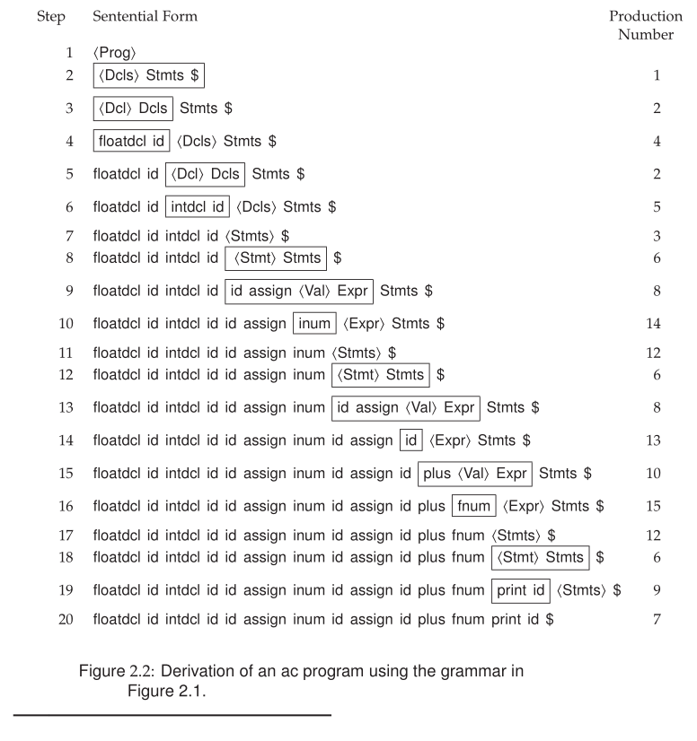

#### 2.2.2 Token Specification

Thus far, a CFG formally defines the sequences of terminal symbols that com-
prise a language. The actual input characters that could correspond to each
terminal symbol must also be specified. The ac grammar in Figure 2.1 uses the
assign symbol as a terminal, but that symbol will appear in the input stream
as the = character. The terminal id could be any alphabetic character except
f, i, or p, which are reserved for special use in ac. In most programming
languages, the strings that could correspond to an id are practically unlimited,
and tokens such as if and while are often reserved keywords.
In addition to the grammar’s terminal symbols, language definitions often
include elements such as comments, blank space, and compilation directives
that must be properly recognized as tokens in the input stream. The formal
specification of a language’s tokens is typically accomplished by associating a
regular expression with each token, as shown in Figure 2.3. A full treatment
of regular expressions can be found in Section 3.2 on page 60.
The specification in Figure 2.3 begins with rules for the language’s reserved
keywords: f, i, and p. The specification for id uses the | symbol to specify the
union of four sets, each a range of characters, so that an id is any lower case
alphabetic character not already reserved. The specification for inum allows
one or more decimal digits. An fnum is like an inum except that it is followed
by a decimal point and then one or more digits.

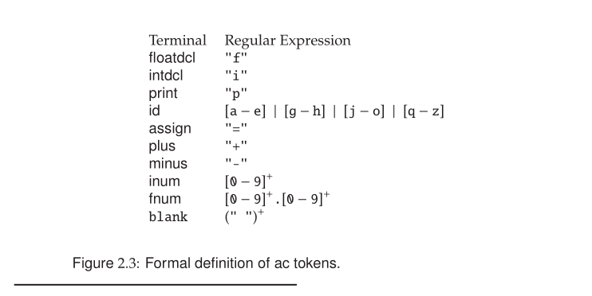

Figure 2.4 illustrates an application of the ac specification to the input
stream shown at the bottom. The tokens corresponding to the input stream
are shown just above the input stream. To save space, the blank tokens are not
shown.

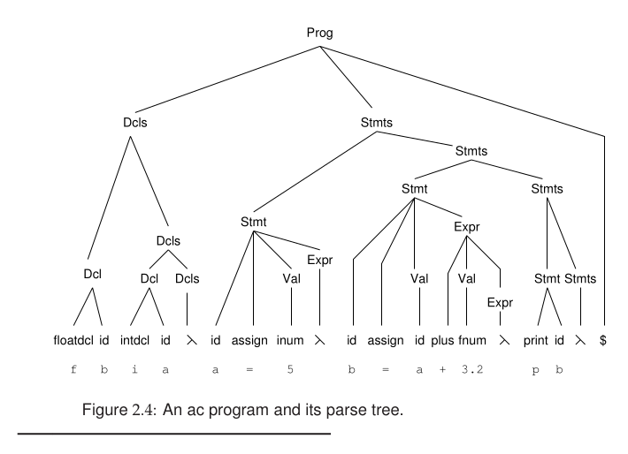

We next consider the phases involved in compiling the ac program shown
in Figure 2.4. The derivation shown textually in Figure 2.2 can be represented
as a derivation (or parse) tree, also shown in Figure 2.4. An input stream
can be automatically transformed into a stream of tokens using the techniques
presented in Chapter 3.
In the following sections we examine each step of the compilation process
for the ac language, assuming an input that would produce the derivation
shown in Figure 2.2. While the treatment is somewhat simplified, the goal is
to show the purpose and data structures of each phase.

### 2.3 Phases of a Simple Compiler

The rest of this chapter presents a simple compiler for ac, structured according
to the illustration in Figure 1.4 on page 15. The phases in the translation process
are as follows:

1. The scanner reads a source ac program as a text file and produces a stream
of tokens. For example, strings such as 5 and 3.2 are recognized as inum
and fnum tokens. Reserved keywords such as f and p are distinguished from variable names such as a and b. For languages of greater complexity,
the techniques presented in Chapter 3 automate much of this task.

2. The parser processes tokens produced by the scanner, determines the
syntactic validity of the token stream, and creates an abstract syntax
tree (AST) suitable for the compiler’s subsequent activities. Given the
simplicity of ac, we write its parser ad hoc using the recursive-descent style
presented in **Chapter 5**. While such parsers work well in many cases,
**Chapter 6** presents a more popular technique for generating parsers
automatically.

3. The AST created by the parsing task is next traversed to create a symbol
table. This table associates type and other contextual information with
variables used in an ac program. Most programming languages allow
the use of an unbounded number of variable names. Techniques for
processing symbols are discussed more generally in Chapter 8. This
task can be greatly simplified for ac, which allows the use of at most 23
variable names.

4. The AST is next traversed to perform semantic analysis. For ac, such
analysis is fairly minimal. For most programming languages, multiple
passes over the AST may be required to enforce programming language
rules that are difficult to check in the parsing task. Semantic analysis
often decorates or transforms portions of an AST as the actual meaning
of such portions becomes more clear. For example, an AST node for the + operator may be replaced with the actual meaning of +, which may
mean floating point or integer addition.

5. Finally, the AST is traversed to generate a translation of the original
program. Necessities such as register allocation and opportunities for
program optimization may be implemented as phases that precede code
generation. For ac, translation is sufficiently simple to be accommodated
in a single code-generation pass.

### 2.4 Scanning

The scanner’s job is to translate a stream of characters into a stream of tokens,
where each token represents an instance of some terminal symbol. Rigorous
methods for automatically constructing scanners based on regular expressions
(such as those shown in Figure 2.3) are covered in Chapter 3. Here, the
job at hand is sufficiently simple to undertake manually. Figure 2.5 shows
pseudocode for a basic, ad hoc scanner that finds tokens for the ac language.
Each token found by the scanner has the following two components:

* A token’s type explains the token’s membership in the terminal alphabet.
All instances of a given terminal have the same token type.
* A token’s semantic value provides additional information about the
token.

For terminals such as plus, no semantic information is required, because only
one token (+) can correspond to that terminal. Other terminals, such as id
and num, require semantic information so that the compiler can record which
identifier or number has been scanned.
The scanner in Figure 2.5 finds the beginning of a token by first skipping
over any blanks.

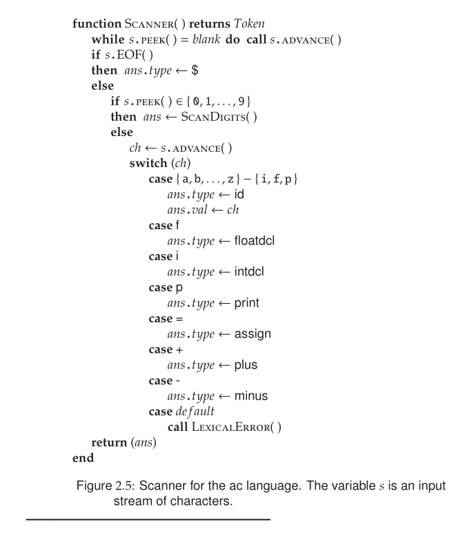

Scanners are often instructed to ignore comments and sym-
bols that serve only to format the text, such as blanks and tabs. Next, using
a single character of lookahead (the peek method), the scanner determines if
the next token will be a num or some other terminal. Because the code for
scanning a number is relatively complex, it is relegated to the ScanDigits pro-
cedure shown in Figure 2.6. Otherwise, the scanner is moved to the next input
character (using advance), which suffices to determine the next token.

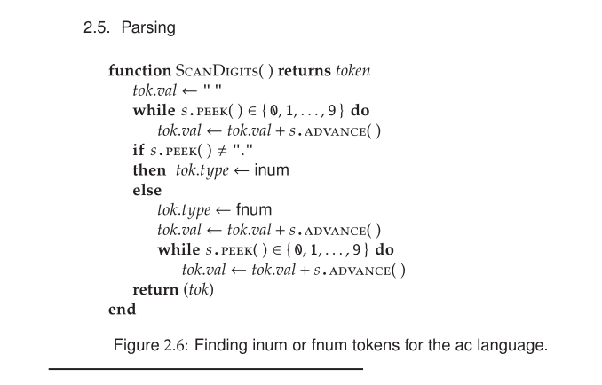

For most programming languages, the scanner’s job is not so easy. Some
tokens (+) can be prefixes of other tokens (++); other tokens such as comments
and string constants have special symbols involved in their recognition. For
example, a string constant is usually surrounded by quote symbols. If such
symbols are meant to appear literally in the string constant, then they are
usually escaped by a special character such as backslash (\). Variable-length
tokens such as identifiers, constants, and comments must be matched character
by character. If the next character is part of the current token, it is consumed.
When a character that cannot be part of the current token is reached, scanning
is complete. Some input files may contain character sequences that do not
correspond to any token and should be flagged as errors.
The inum- and fnum-finding code in Figure 2.6 is written ad hoc, yet the
logic of its construction is patterned after the tokens’ regular expressions. A
recurring theme in compiler construction is the use of such principled ap-
proaches and patterns to guide the crafting of a compiler’s phases.
While the code in Figures 2.5 and 2.6 serves to illustrate the nature of a
scanner, we emphasize that the most reliable and expedient methods for con-
structing scanners do so automatically from regular expressions, as covered in
Chapter 3. Such scanners are reasonably efficient and correct by construction,
given a correct set of regular-expression specifications for the tokens.

### 2.5 Parsing

The parser is responsible for determining if the stream of tokens provided
by the scanner conforms to the language’s grammar specification. In most compilers the grammar serves not only to define the syntax of a programming
language, but also to guide the automatic construction of a parser, as described
in Chapters 4, 5, and 6. In this section we build a parser for ac using a well-
known parsing technique called ### [Recursive descent parser](https://en.wikipedia.org/wiki/Recursive_descent_parser), which is described more fully
in Chapter 5.
Recursive descent is one of the simplest parsing techniques used in practi-
cal compilers. The name is taken from the mutually recursive parsing routines
that, in effect, descend through a derivation tree. In recursive-descent pars-
ing, each nonterminal in the grammar has an associated parsing procedure that
is responsible for determining if the token stream contains a sequence of to-
kens derivable from that nonterminal. For example, the nonterminal Stmt is
associated with the parsing procedure shown in Figure 2.7.
We next illustrate how to write recursive descent parsing procedures for
the nonterminals Stmt and Stmts from the grammar in Figure 2.1. Section 2.5.1
explains how such parsers predict which production to apply, and Section 2.5.2
explains the actions taken on behalf of a production.

#### 2.5.1 Predicting a Parsing Procedure

Each procedure first examines the next input token to predict which production
should be applied. For example, Stmt offers two productions:
```C
Stmt →id assign Val Expr
Stmt →print id
```
In Figure 2.7, Markers 1 and 6 pick which of those two productions should
be followed by examining the next input token:


* If id is the next input token, then the parse must proceed with a rule that
generates id as its first terminal. Because Stmt →id assign Val Expr is the
only rule for Stmt that first generates an id, it must be uniquely predicted
by the id token. Marker 1 in Figure 2.7 performs this test.
We say that the predict set for Stmt → id assign Val Expr is { id }.

* Similarly, if print is the next input token, the production Stmt → print id is
predicted by the test at Marker 6 . The predict set for Stmt →print id is
{ print }.

* Finally, if the next input token is neither id nor print, then neither rule
can be predicted. Given that the Stmt procedure is called only where the
nonterminal Stmt should be derived, the input must have a syntax error,
as reported at Marker 7 .

Computing the predict sets used in Stmt is relatively easy, because each pro-
duction for Stmt begins with a distinct terminal symbol (id or print). However,
consider the productions for Stmts:

```C
Stmts → Stmt Stmts
Stmts → λ
```
The predict sets for Stmts in Figure 2.8 cannot be computed so easily by
inspection because of the following:

* The production Stmts →Stmt Stmts begins with the nonterminal Stmt.
To discover the terminals that predict this rule, we must find those sym-
bols that predict any rule for Stmt. Fortunately, we have already done
this in Figure 2.7. The predicate at Marker 8 in Figure 2.8 checks for id
or print as the next token.

* The production Stmts →λ derives no symbols, so we must look instead
for what symbols could occur after such a production. Grammar anal-
ysis (Chapter 4) can show that $ is the only such symbol, so it predicts
Stmts → λ at Marker 11 .

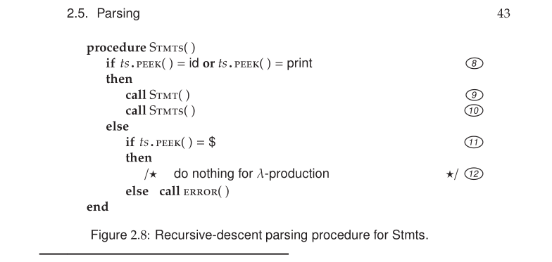

#### 2.5.2 Implementing the Production

Once a given production has been predicted, the recursive descent procedure
then executes code to trace across that production, one symbol at a time.
For example, the production Stmt → id assign Val Expr in Figure 2.7 derives 4
symbols, and those will be considered in the order id, assign, Val, and Expr.
The code for processing those symbols, shown at Markers 2 , 3 , 4 , and 5 ,
is written into the recursive descent procedure as follows:

* When a terminal such as id is encountered, a call to match( ts, id ) is
placed into the code, as shown by Marker 2 in Figure 2.7. The match
procedure (code shown in Figure 5.5 on page 149) simply consumes the
expected token id if it is indeed the next token in the input stream. If
some other token is found, then the input stream has a syntax error, and
an appropriate message is issued. The call after Marker 2 tries to match
assign, which is the next symbol in the production.

* The last two symbols in Stmt → id assign Val Expr are nonterminals. The
recursive descent parser has a method responsible for the derivation of
each nonterminal in a grammar. Thus, the code at Marker 4 calls the
procedure Val associated with the nonterminal Val. Finally, the Expr
method is called on behalf of the last symbol.
In Figure 2.8, the code executed on behalf of Stmts →Stmt Stmts first
calls Stmt at Marker 9 and then calls Stmts recursively at Marker 10 .
Recursive calls appear on behalf of grammar productions that reference
each other. Recursive descent parsers are named after the manner in
which the parser’s methods call each other.

* The only other symbol that can be encountered is λ, as in Stmts → λ. For
such productions, no symbols are derived from the nonterminal. Thus,
no code is executed on behalf of such rules, as shown at Marker 12 in
Figure 2.8.

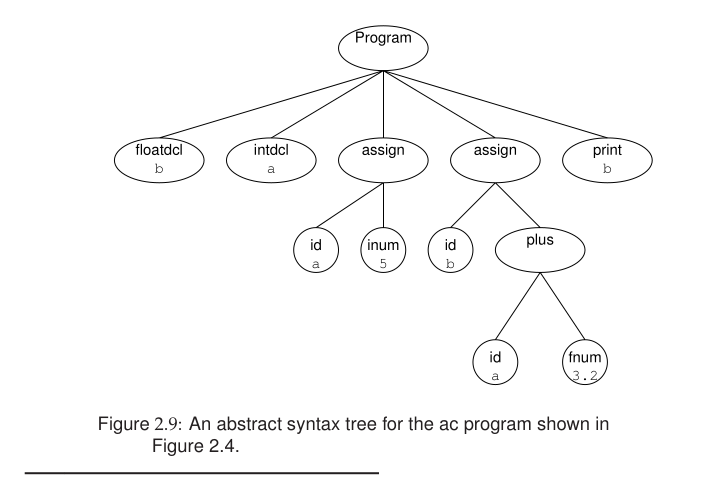

### 2.6 Abstract Syntax Trees

The scanner and parser together accomplish the syntax analysis phase of a
compiler. They ensure that the compiler’s input conforms to a language’s
token and CFG specifications. While the process of compilation begins with
scanning and parsing, following are some aspects of compilation that can be
difficult or even impossible to perform during syntax analysis:

* Most programming language specifications include prose that describes
aspects of the language that cannot be specified in a CFG. For example,
strongly typed languages insist that symbols be used in ways consistent
with their type declaration. For languages that allow new types to be
declared, a CFG cannot presuppose the names of such types nor the
manner in which they should properly be used. Even if the set of types
is fixed by a language, enforcing proper usage usually requires some
context sensitivity that is clearly not available in a CFG.
Some languages use the same syntax to describe phrases whose meaning
cannot be made clear in a CFG. For example, the phrase x.y.z in Java
could mean a package x, a class y, and a static field z. That same phrase
could also mean a local variable x, a field y, and another field z. In
fact, many other meanings are possible: Java provides (6 pages of) rules
to determine which of the possible interpretations holds for a given
phrase, given the packages and classes that are present during a given
compilation.
Most languages allow operators to be overloaded to mean more than
one actual operation. For example, the + operator might mean numerical
addition or the appending of strings. Some languages allow the meaning
of an operator to be defined in the program itself.
In all of the above cases, a programming language’s CFG alone provides
insufficient information to understand the full meaning of a program.

* For relatively simple languages, syntax-directed translation can perform
almost all aspects of program translation during syntax analysis. Com-
pilers written in that fashion are arguably more efficient than compilers
that perform a separate pass over a program for each phase. However,
from a software engineering perspective, the separation of activities and
concerns into phases (such as syntax analysis, semantic analysis, opti-
mization, and code generation) makes the resulting compiler much easier
to write and maintain.


In response to the above concerns, we might consider using the parse tree
as the structure that survives syntax analysis and is used for the remaining
phases. However, as Figure 2.4 shows, such trees can be rather large and
unnecessarily detailed, even for very simple grammars and inputs.

It is therefore common practice to create an artifact of syntax analysis
known as the abstract syntax tree (AST). This structure contains the essen-
tial information from a parse tree, but inessential punctuation and delimiters
(braces, semicolons, parentheses, etc.) are not included. For example, Fig-
ure 2.9 shows an AST for the parse tree of Figure 2.4. In the parse tree, 8
nodes are devoted to generating the expression a + 3.2, but only 3 nodes are
required to show the essence of that expression in Figure 2.9.

The AST serves as a common, intermediate representation for a program
for all phases after syntax analysis. Such phases may make use of information
in the AST, decorate the AST with more information, or transform the AST.
Thus, the needs of the compiler’s phases must be considered when designing
an AST. For the ac language, such considerations are as follows:

* Declarations need not be retained in source form. However, a record of
identifiers and their declared types must be retained to facilitate symbol
table construction and semantic type checking, as described in Section 2.7.
Each Dcl in the parse tree of Figure 2.4 is represented by a single node in
the AST of Figure 2.9.

* The order of the executable statements is important and must be explicitly
represented, so that code generation (Section 2.8) can issue instructions in
the proper order.

* An assignment statement must retain the identifier that will hold the
computed value and the expression that computes the value. Each assign
node in Figure 2.9 has exactly two children.
* Nodes representing computation such as plus and minus can be repre-
sented in the AST as a node specifying the operation with two children
for the operands.
* A print statement must retain the name of the identifier to be printed. In
the AST, the identifier is stored directly in the print node.

It is common to revisit and modify the AST’s design as the compiler is being
written, in response to the needs of the various phases of the compiler. Object-
oriented design patterns such visitor facilitate the design and implementation
of the AST, as discussed in Chapter 7.

### 2.7 Semantic Analysis

The next phase to consider is semantic analysis, which is really a catchall
term for any post-parsing processing that enforces aspects of a language’s
definition that are not easily accommodated by syntax analysis. Examples of
such processing include the following:

* Declarations and name scopes are processed to construct a symbol table,
so that declarations and uses of identifiers can be properly coordinated.

* Language- and user-defined types are examined for consistency.

* Operations and storage references are processed so that type-dependent
behavior can become explicit in the program representation.

For the ac language, we focus on two aspects of semantic analysis: symbol-
table construction and type checking.

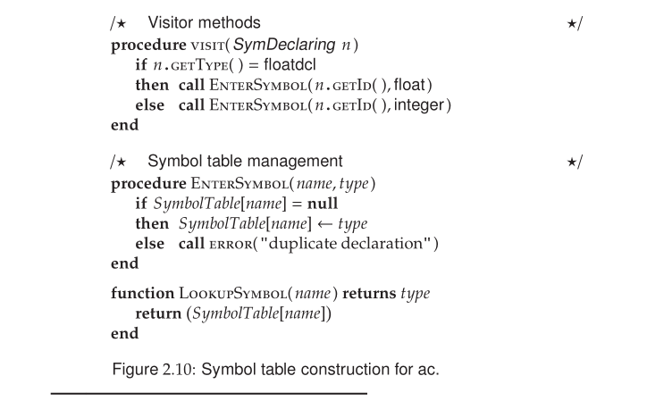

#### 2.7.1 Symbol Tables

In ac, identifiers must be declared prior to use, but this requirement is not easily
enforced during syntax analysis. Symbol-table construction is a semantic-
processing activity that traverses the AST to record all identifiers and their
types in a symbol table. In most languages the set of potential identifiers is
essentially infinite. In ac a program can mention at most 23 distinct identifiers.
As a result, an ac symbol table has 23 entries indicating each identifier’s type:
integer, float, or unused (null). In most programming languages the type
information associated with a symbol includes other attributes, such as the
identifier’s scope of visibility, storage class, and protection properties.

To create an ac symbol table, we traverse the AST, counting on the pres-
ence of a symbol-declaring node to trigger appropriate effects on the symbol table. This can be arranged by having nodes such as floatdcl and intdcl imple-
ment an interface (or inherit from an empty class) called SymDeclaring, which
implements a method to return the declared identifier’s type. In Figure 2.10,
visit( SymDeclaring n ) shows the code to be applied at nodes that declare
symbols. As declarations are discovered, EnterSymbol checks that the given
identifier has not been previously declared. Figure 2.11 shows the symbol
table constructed for our example ac program.

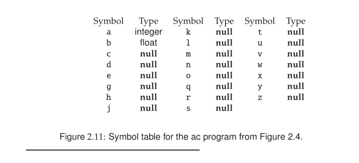

#### 2.7.2 Type Checking

The ac language offers only two types, integer and float, and all identifiers
must be type-declared in a program before they can be used. After the symbol
table has been constructed, the declared type of each identifier is known, and
the executable statements of the program can be checked for type consistency.
Most programming language specifications include a type hierarchy that
compares the language’s types in terms of their generality. Our ac language
follows in the tradition of Java, C, and C++, in which a float type is considered
wider (i.e., more general) than an integer. This is because every integer can be
represented as a float. On the other hand, narrowing a float to an integer loses
precision for some float values.
Most languages allow automatic widening of type, so an integer can be
converted to a float without the programmer having to specify this conver-
sion explicitly. On the other hand, a float cannot become an integer in most
languages unless the programmer explicitly calls for this conversion.
Once symbol type information has been gathered, ac’s executable state-
ments can be examined for consistency of type usage. This process, known as
type checking, walks the AST bottom-up, from its leaves toward its root. At
each node, the appropriate visitor method (if any) in Figure 2.12 is applied:

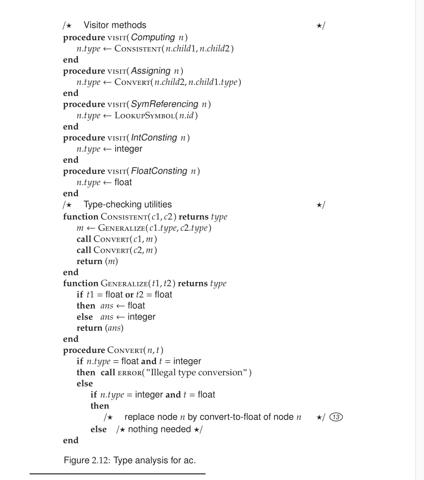


* For constants and symbol references, the visitor methods simply set the
supplied node’s type based on the node’s contents.
* For nodes that compute values, such as plus and minus, the appropriate
type is computed by calling the utility methods in Figure 2.12. If both
types are integer, the resulting computation is integer; otherwise, the
resulting type is float.
* For an assignment operation, the visitor makes certain that the value
computed by the second child is of the same type as the assigned identi-
fier (the first child).

The Consistent method, shown in Figure 2.12, is responsible for reconciling
the type of a pair of AST nodes using the following steps:
1. The Generalize function determines the least general (i.e., simplest) type
that encompasses its supplied pair of types. For ac, if either type is float,
then float is the appropriate type; otherwise, integer will do.
2. The Convert procedure checks whether conversion is necessary, possi-
ble, or impossible. An important consequence occurs at Marker 13 in
Figure 2.12. If conversion is attempted from integer to float, then the AST is transformed to represent this type conversion explicitly. Subse-
quent compiler passes (particularly code generation) can then assume a
type-consistent AST in which all operations are explicit.

The results of applying semantic analysis to the AST of Figure 2.9 are shown
in Figure 2.13.

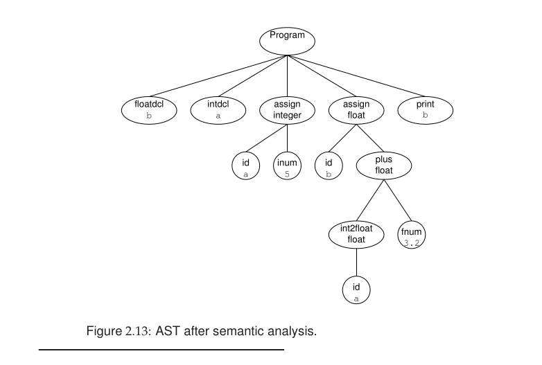

---

### 2.8 Code Generation

The final task undertaken by a compiler is the formulation of target-machine
instructions that faithfully represent the semantics (i.e., meaning) of the source
program. This process is called code generation. Our translation exercise
consists of generating source code that is suitable for the dc program, which
is a simple calculator based on a stack machine model. In a stack machine,
most instructions receive their input from the contents at or near the top of
an operand stack. The result of most instructions is pushed on the stack.
Programming languages such as C and Java are frequently translated into a
portable, stack machine representation.
Chapters 11 and 13 discuss code generation in detail. Modern compilers
often generate code automatically, based on a description of the target ma-
chine’s instruction set. Our translation task is sufficiently simple to allow an
ad hoc approach.
The AST was transformed and decorated with type information during
semantic analysis. Such information is required for selecting the proper in-
structions. For example, the instruction set on most computers distinguishes
between float and integer data types.
Code generation proceeds by traversing the AST, starting at its root and
working toward its leaves. As usual, we allow a visitor to apply methods
based on the node’s type, as shown in Figure 2.14.

* visit( Computing n ) generates code for plus and minus. First, the code
generator is called recursively to generate code for the left and right
subtrees. The resulting values will be at top-of-stack, so the appropriate
operator is then emitted (Marker 15 ) to perform the operation.

* visit( Assigning n ) causes the expression to be evaluated. Code is then
emitted to store the value in the appropriate dc register. The calculator’s
precision is then reset to integer by setting the fractional precision to zero
(Marker 14 )

* visit( SymReferencing n ) causes a value to be retrieved from the appro-
priate dc register and pushed onto the stack.

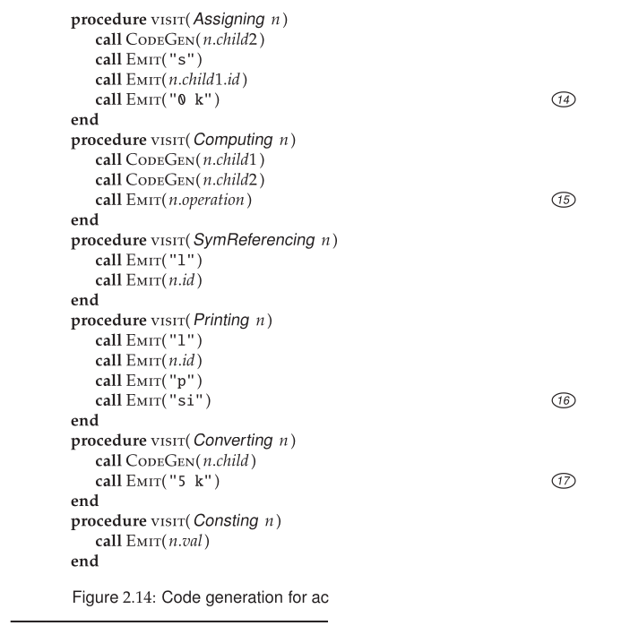

* visit( Printing n ) is tricky because dc does not discard the value on top-
of-stack after it is printed. The instruction sequence si is generated at
Marker 16 , thereby popping the stack and storing the value in dc’s i
register. Conveniently, the ac language precludes a program from using
this register because the i token is reserved for spelling the terminal
symbol integer.

* visit( Converting n ) causes a change of type from integer to float at
Marker 17 . This is accomplished by setting dc’s precision to five frac-
tional decimal digits.

Figure 2.15 shows how code is generated for the AST shown in Figure 2.9.
Each section shows the code generated for a particular subtree of Figure 2.9.

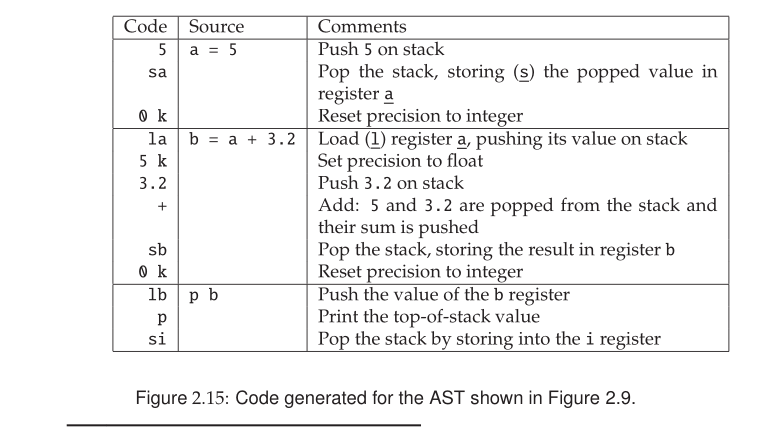

Even in this ad hoc code generator, one can see a principled approach. The
code sequences triggered by various AST nodes dovetail to carry out the
instructions of the input program. Although the task of code generation for
real programming languages and targets is more complex, the theme still holds
that pieces of individual code generation contribute to a larger effect.

This finishes our tour of a compiler for the ac language. While each of
the phases becomes more involved as we move toward working with real pro-
gramming languages, the spirit of each phase remains the same. In the ensuing
chapters, we discuss how to automate many of the tasks described in this chap-
ter. We develop skills necessary to craft a compiler’s phases to accommodate
issues that arise when working with real programming languages.

