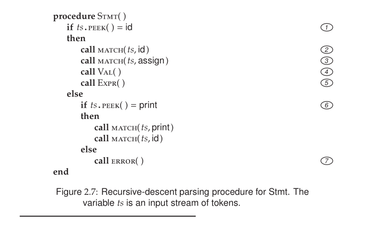

### Question No. 5

The recursive-descent code shown in  contains redundant tests
for the presence of some terminal symbols. How would you decided
which ones are redundant?

### Solution

In recursive-descent parsing, a test is redundant when the grammar and the parser’s control flow already guarantee that a certain token must be present at that point. In other words, the parser has enough context to know what token should appear next, so checking again is unnecessary.

The redundant tests arise because the parser first examines the lookahead token to decide which production rule to apply and then immediately calls Match() on the same terminal symbol, even though Match() performs the same check again. These redundancies can be identified by examining the grammar’s FIRST sets and determining whether the lookahead token uniquely selects a production alternative. In the Stmt() procedure, once the parser sees id, it already knows that the production Stmt → id assign Val Expr must be used, so the subsequent Match(ts,id) repeats the same verification. Similarly, after detecting print, the later Match(ts,print) is also redundant. However, such redundancy is often retained in recursive-descent parsers to improve error detection and simplify debugging.