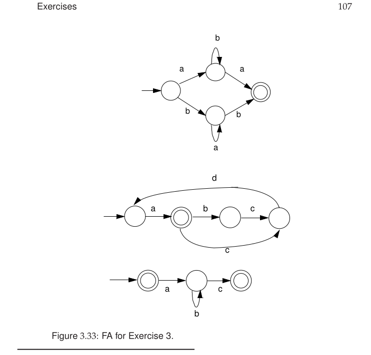

### Question No. 3

Write regular expressions that define the strings recognized by the FAs
in Figure 3.33 on page 107



### Solution

For Figure 3.33, the regular expressions are: 

```txt
1) ab*a | ba*b

2) a(cda | bcda)*
   or equivalently:
   a(b?cda)*

3) ε | ab*c
```

Meaning:

```txt
1) starts with a and ends with a with zero or more b's inside,
   OR starts with b and ends with b with zero or more a's inside.

2) starts with a, then repeats either cda or bcda.

3) accepts the empty string ε, or strings of the form a followed by zero or more b's followed by c.
```
