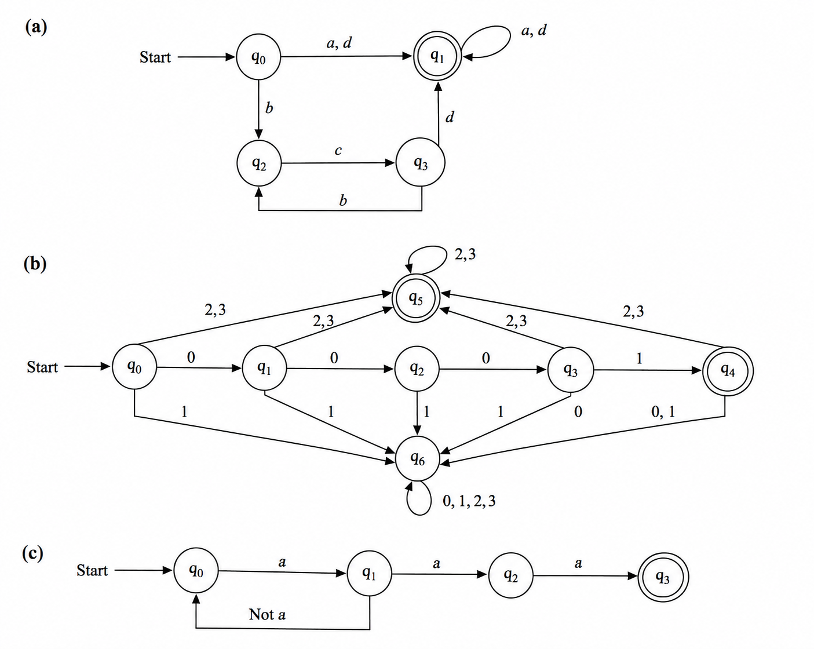

### Question No. 4

Write DFAs that recognize the tokens defined by the following regular
expressions:
*  (a | (bc) * d)+
* ((0 | 1) * (2 | 3)+ ) | 0011
* (a Not(a)) * aaa

### Solution

Assuming the odd symbol is `*`, the regexes are:

```txt
(a) (a | (bc)*d)+
(b) ((0 | 1)*(2 | 3)+) | 0011
(c) (a Not(a))* aaa
```

### (a) DFA for `(a | (bc)*d)+`

Final state: `q1`

| State | a    | b    | c    | d    |
| ----- | ---- | ---- | ---- | ---- |
| `q0`  | `q1` | `q2` | dead | `q1` |
| `q1`  | `q1` | `q2` | dead | `q1` |
| `q2`  | dead | dead | `q3` | dead |
| `q3`  | dead | `q2` | dead | `q1` |
| dead  | dead | dead | dead | dead |

---

### (b) DFA for `((0 | 1)*(2 | 3)+) | 0011`

Final states: `q4`, `q5`

| State | 0    | 1    | 2    | 3    |
| ----- | ---- | ---- | ---- | ---- |
| `q0`  | `q1` | `q6` | `q5` | `q5` |
| `q1`  | `q2` | `q6` | `q5` | `q5` |
| `q2`  | `q6` | `q3` | `q5` | `q5` |
| `q3`  | `q6` | `q4` | `q5` | `q5` |
| `q4`  | `q6` | `q6` | `q5` | `q5` |
| `q5`  | dead | dead | `q5` | `q5` |
| `q6`  | `q6` | `q6` | `q5` | `q5` |
| dead  | dead | dead | dead | dead |

Here, `q4` accepts the special string `0011`, and `q5` accepts strings ending in one or more `2`/`3`.

---

### (c) DFA for `(a Not(a))* aaa`

Let `x = Not(a)`, meaning any character except `a`.

Final state: `q3`

| State | a    | x = Not(a) |
| ----- | ---- | ---------- |
| `q0`  | `q1` | dead       |
| `q1`  | `q2` | `q0`       |
| `q2`  | `q3` | dead       |
| `q3`  | dead | dead       |
| dead  | dead | dead       |

This accepts:

```txt
aaa
axaaa
axaxaaa
axaxaxaaa
...
```

where every `x` is some non-`a` character.

