# Chatper No. 4 Parsing and Grammars

### 4.1 Context Free Grammars

A context-free grammar (CFG) is
a compact, finite representation of a language, defined by the following four
components:
* A finite terminal alphabet Σ. This is the set of tokens produced by the
scanner. We always augment this set with the token $, which signifies
end-of-input.
* A finite nonterminal alphabet N. Symbols in this alphabet are variables
of the grammar.
* A start symbol S ∈ N that initiates all derivations. S is also called the
goal symbol.
* A finite set of productions P (sometimes called rewriting rules) of the
form A → X1 . . . Xm , where A ∈ N, Xi ∈ N ∪ Σ, 1 ≤ i ≤ m, and m ≥ 0. The
only valid production with m = 0 is of the form A→ λ, where λ denotes
the empty string.

These components are often expressed as G = ( N, Σ, P, S ), which is the formal
definition of a CFG. The terminal and nonterminal alphabets must be disjoint
(i.e., Σ ∩ N = ∅). The vocabulary V of a CFG is the set of terminal and
nonterminal symbols (i.e., V = Σ ∪ N).
A CFG is essentially a recipe for creating strings. Starting with S, non-
terminals are rewritten using the grammar’s productions until only terminals
remain. A rewrite using the production A →α replaces the nonterminal A with
the vocabulary symbols in α. As a special case, a rewrite using the production A →λ causes A to be erased. Each rewrite is a step in a derivation of the resulting string. The set of terminal strings derivable from S comprises the
context-free language of grammar G, denoted L(G).

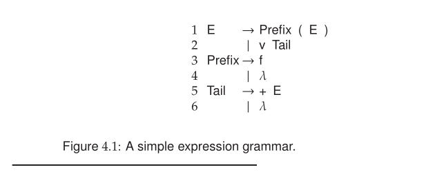

### 4.1.1 Leftmost Derivations

A derivation that always chooses the leftmost possible nonterminal at each
step is called a leftmost derivation. If we know that a derivation is leftmost,
we need only specify the productions in the order of their application; the
expanded nonterminal is implicit. To denote derivations that are leftmost,
we use ⇒lm , ⇒+lm , and ⇒lm . A sentential form produced via a leftmost
derivation is called a left sentential form. The production sequence discovered
by a large class of parsers (the top-down parsers) is a leftmost derivation.
Hence, these parsers are said to produce a leftmost parse.
As an example, consider the grammar shown in Figure 4.1, which gener-
ates simple expressions (v represents a variable and f represents a function).

### 4.1.2 Rightmost Derivations

An alternative to a leftmost derivation is a rightmost derivation (sometimes
called a canonical derivation). In such derivations, the rightmost possible nonterminal is always expanded. This derivation sequence may seem less
intuitive given the English convention of processing information left to right.
However, such derivations are produced by an important class of parsers,
namely the bottom-up parsers discussed in Chapter 6.
As a bottom-up parser discovers the productions that derive a given token
sequence, it traces a rightmost derivation, but the productions are applied in
reverse order. That is, the last step taken in a rightmost derivation is the first
production applied by the bottom-up parser; the first step involving the start
symbol is the parser’s final production. The sequence of productions applied
by a bottom-up parser is called a rightmost or canonical parse. For derivations
that are rightmost, the notation ⇒rm , ⇒+rm , and ⇒*rm is used. A sentential
form produced via a rightmost derivation is called a right sentential form.

### 4.1.3 Parse Trees

A derivation is often represented by a parse tree (sometimes called a derivation
tree). A parse tree has the following characteristics:
* It is rooted by the grammar’s start symbol S.
* Each node is either a grammar symbol or λ.
* Its interior nodes are nonterminals. An interior node and its children
represent the application of a production. That is, a node representing
a nonterminal A can have offspring X1 , X2 , . . . , Xm if, and only if, there
exists a grammar production A→ X1 X2 . . . Xm . When a derivation is
complete, each leaf of the corresponding parse tree is either a terminal
symbol or λ.

Figure 4.2 shows the parse tree for f ( v + v ) using the grammar from Figure 4.1.
Parse trees serve nicely to visualize how a string is structured by a grammar.
A leftmost or rightmost derivation is essentially a textual representation of a
parse tree, but the derivation also conveys the order in which the productions
are applied.
A sentential form is derivable from a grammar’s start symbol. Hence,
a parse tree must exist for every sentential form. Given a sentential form and its parse tree, a phrase of the sentential form is a sequence of symbols
descended from a single nonterminal in the parse tree. A simple or prime
phrase is a phrase that contains no smaller phrase. That is, it is a sequence of
symbols directly derived from a nonterminal. The handle of a sentential form
is the leftmost simple phrase. (Simple phrases cannot overlap, so “leftmost”
is unambiguous.) Given the parse tree of Figure 4.2 and the sentential form
f ( v Tail ), f and v Tail are simple phrases and f is the handle. Handles are
important because they represent individual derivation steps, which can be
recognized by various parsing techniques.

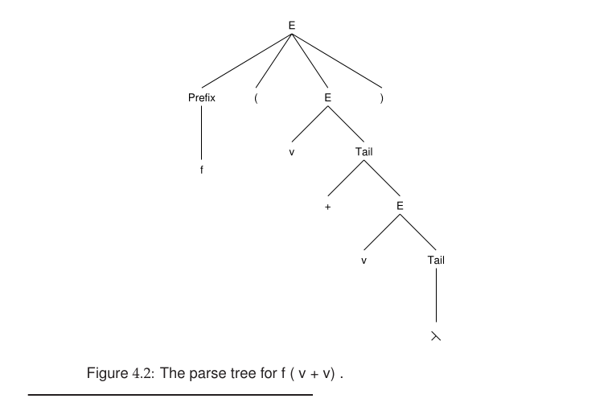

### 4.1.4 Other Types of Grammars

Although CFGs serve well to characterize syntax, most programming lan-
guages contain rules that are not expressible using CFGs. For example, the
rule that variables must be declared before they are used cannot be expressed
because a CFG provides no mechanism for transmitting to the body of a pro-
gram the exact set of variables that has been declared. In practice, syntactic
details that cannot be represented in a CFG are considered part of the static
semantics and are checked by semantic routines (along with scope and type
rules).

The following grammars are relevant to programming language translation:
* Regular grammars, which are less powerful than CFGs
* Context-sensitive and unrestricted grammars, which are more powerful.

### Regular Grammars

### Regular Grammar

A **regular grammar** is a restricted type of grammar that generates:

```txt
regular languages
```

These are the same languages recognized by:

```txt
finite automata
```

and described by:

```txt
regular expressions
```

So these three are equivalent:

| Formalism | Recognizes |
|---|---|
| Regular Expressions | Regular Languages |
| Finite Automata | Regular Languages |
| Regular Grammars | Regular Languages |

---

### Core Idea

A regular grammar is very limited.

Its productions must follow a strict form.

---

### Two Types of Regular Grammars

#### 1. Right-Linear Grammar

Rules look like:

```txt
A → aB
A → a
A → λ
```

Meaning:

```txt
terminal first,
optional nonterminal LAST
```

Example:

```txt
S → aA
A → bB
B → c
```

This generates:

```txt
abc
```

---

#### 2. Left-Linear Grammar

Rules look like:

```txt
A → Ba
A → a
A → λ
```

Meaning:

```txt
nonterminal first,
terminal LAST
```

Example:

```txt
S → Ab
A → Ba
B → c
```

---

### Important Restriction

You must NOT mix:

```txt
left-linear
and
right-linear
```

in the same grammar.

Otherwise the grammar may become nonregular.

---

### Example of Regular Grammar

Grammar:

```txt
S → aS
S → bS
S → λ
```

This generates:

```txt
(a|b)*
```

meaning:

```txt
all strings of a's and b's
```

Examples:

```txt
λ
a
b
ab
aabbb
bababa
```

---

### Equivalent DFA

The grammar:

```txt
S → aS | bS | λ
```

corresponds to a DFA with:

```txt
one looping accepting state
```

because the language is:

```txt
(a|b)*
```

---

### Example 2

Grammar:

```txt
S → aA
A → bB
B → c
```

Generates only:

```txt
abc
```

---

### Parse Derivation

```txt
S
⇒ aA
⇒ abB
⇒ abc
```

---

### Relationship to Finite Automata

Every regular grammar can be converted into a finite automaton.

---

### Conversion Idea

Rule:

```txt
A → aB
```

becomes transition:

```txt
A --a--> B
```

Rule:

```txt
A → a
```

becomes:

```txt
A --a--> FinalState
```

---

### Example Conversion

Grammar:

```txt
S → aA
A → b
```

becomes DFA:

```txt
S --a--> A --b--> Final
```

---

### Why Regular Grammars Are Limited

Regular grammars cannot represent recursive nesting.

They cannot handle:

```txt
balanced parentheses
nested blocks
recursive expressions
```

Example NOT regular:

```txt
a^n b^n
```

because finite automata have no stack memory.

---

### CFG vs Regular Grammar

| Feature | Regular Grammar | CFG |
|---|---|
| Generates | regular languages | context-free languages |
| Equivalent Machine | finite automaton | pushdown automaton |
| Supports nesting | no | yes |
| Memory | finite states only | stack |
| Power | weaker | stronger |

---

### Example of Nonregular Language

Grammar:

```txt
S → aSb | λ
```

This generates:

```txt
a^n b^n
```

Examples:

```txt
λ
ab
aabb
aaabbb
```

This is NOT a regular grammar because:

```txt
nonterminal appears in the middle
```

and the language requires counting.

---

### Regular Grammar Intuition

A regular grammar behaves like:

```txt
a state machine writing symbols left-to-right
```

Each production:

```txt
prints one terminal
and optionally moves to another state
```

That is exactly how DFAs work.

---

### Chomsky Hierarchy Connection

Regular grammars are:

```txt
Type-3 grammars
```

in the Chomsky hierarchy.

Hierarchy:

| Type | Grammar |
|---|---|
| Type 0 | unrestricted |
| Type 1 | context-sensitive |
| Type 2 | context-free |
| Type 3 | regular |

Regular grammars are the weakest but simplest class.

### Beyond Context-Free Grammars

CFGs can be generalized to create richer notational mechanisms. A context-
sensitive grammar requires that nonterminals be rewritten only when they
appear in a particular context (for example, αAβ →αδβ), provided the rule
never causes the sentential form to contract in length. An unrestricted or type-
0 grammar is the most general. It allows arbitrary patterns to be rewritten.
Although context-sensitive and unrestricted grammars are more powerful
than CFGs, they also are far less useful for the following reasons:
* Efficient parsers for such grammars do not exist. Without a parser, a
grammar definition cannot participate in the automatic construction of
compiler components.
* It is difficult to prove properties about such grammars. For example, it
would be daunting to prove that a given type-0 grammar generates the
C programming language.

Efficient parsers for many classes of CFGs do exist. Hence, CFGs present a
nice balance between generality and practicality.

### 4.2 Properties of CFGs

CFGs are a notational mechanism for specifying languages. Just as there
are many programs that compute the same result, so also there are many
grammars that generate the same language. Some are better suited for a
particular translation task, as discussed in Chapter 7. Some grammars have
one or more of the following problems that preclude their use:
* The grammar may include useless symbols.
* The grammar may allow multiple, distinct derivations (parse trees) for
some input string.
* The grammar may include strings that do not belong in the language, or
the grammar may exclude strings that are in the language.

In this section, we discuss these problems and their implication for language
processing.

### 4.2.1 Reduced Grammars

A grammar is reduced if each of its nonterminals and productions participates
in the derivation of some string in the grammar’s language. Nonterminals
that can be safely removed are called useless.

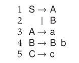

The above grammar contains two kinds of nonterminals that cannot participate
in any derived string:
* With S as the start symbol, the nonterminal C cannot appear in any
phrase.
* Any phrase that mentions B cannot be rewritten using the grammar’s
rules to contain only terminals.

When B, C, and their associated productions are removed, the following re-
duced grammar is obtained:

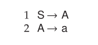

Exercises 16 and 17 consider how to detect both forms of useless nontermi-
nals. Many parser generators verify that a grammar is in reduced form. An
unreduced grammar probably contains errors that result from mistyping of
grammar specifications.


### 4.2.2 Ambiguity

Some grammars allow a derived string to have two or more different parse
trees (and thus a nonunique structure). Consider the following grammar,
which generates expressions using the infix operator for subtraction.

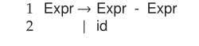

This grammar allows two different parse trees for id - id - id, as illustrated in
Figure 4.3. The tree in Figure 4.3(a) models the subraction of the third id from
the difference of the first two. The tree in Figure 4.3(b) subtracts the difference
of the last two id symbols from the first. If the id symbols have values 3, 2, and
1, then tree Figure 4.3(a) evaluates to 0, while tree Figure 4.3(b) evaluates to 2.
Grammars that allow different parse trees for the same terminal string are
called ambiguous. They are rarely used because a unique structure (i.e., parse
tree) cannot be guaranteed for all inputs. Hence, a unique translation, guided
by the parse tree structure, may not be obtained.
It seems we need an algorithm that checks an arbitrary CFG for ambiguity.
Unfortunately, no algorithm is possible for this in the general case, as the prob-
lem is undecidable [HU79, Mar03].


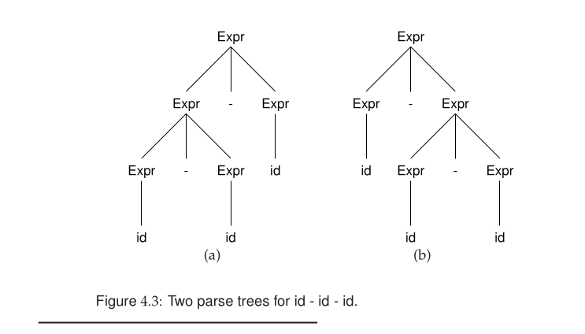

### 4.2.3 Faulty Language Definition

The most potentially serious flaw that a grammar might have is that it generates
the “wrong” language. That is, the terminal strings derivable by the grammar
do not correspond exactly to the strings present in the desired language. This
is a subtle point, because a grammar typically serves as the very definition of
a language’s syntax.
The correctness of a grammar is usually tested informally by attempting
to parse a set of inputs, some of which are supposed to be in the language and
some of which are not. One might try to compare for equality the languages
defined by a pair of grammars (considering one a standard), but this is rarely
done. For some grammar classes, such verification is possible; for others, no
comparison algorithm is known. Determining in general whether two CFGs
generate the same language is an undecidable problem.

### 4.3 Transforming Extended Grammars

Backus-Naur form (BNF) extends the grammar notation defined in Section 4.1
with syntax for defining optional and repeated symbols.
* Optional symbols are enclosed in square brackets. In the production
A →α [ X1 . . . Xn ] β
the symbols X1 . . . Xn are entirely present or absent between the symbols
of α and β.
* Repeated symbols are enclosed in braces. In the production
B→ γ { X1 . . . Xm } δ
the entire sequence of symbols X1 . . . Xm can be repeated zero or more
times.

These extensions are useful in representing many programming language con-
structs. In JavaTM , declarations can optionally include modifiers such as final,
static, and const. Each declaration can include a list of identifiers. A pro-
duction specifying a Java-like declaration could be as follows:

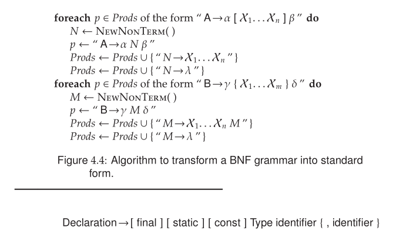

This declaration insists that the modifiers be ordered as shown. Exercises 13
and 14 consider how to specify the optional modifiers in any order.
Although BNF can be useful, algorithms for analyzing grammars and
building parsers assume the standard grammar notation as introduced in
Section 4.1. The algorithm in Figure 4.4 transforms extended BNF grammars
into standard form. For the BNF syntax involving braces, the transformation
uses right recursion on M to allow zero or more occurrences of the symbols
enclosed within braces. This transformation also works using left recursion—
the resulting grammar would have generated the same language.
As discussed in Section 4.1, a particular derivation (e.g., leftmost or right-
most) depends on the structure of the grammar. It turns out that right-recursive
rules are more appropriate for top-down parsers, which produce leftmost
derivations. Similarly, left-recursive rules are more suitable for bottom-up
parsers, which produce rightmost derivations.

### 4.4 Parsers and Recognizers

Compilers are expected to verify the syntactic validity of their inputs with
respect to a grammar that defines the programming language’s syntax. Given
a grammar G and an input string x, the compiler must determine if x ∈ L(G).
An algorithm that performs this test is called a recognizer.
For language translation, we must determine not only the string’s validity,
but also its structure, or parse tree. An algorithm for this task is called a parser.
Generally, there are two approaches to parsing:

* A parser is considered top-down if it generates a parse tree by starting
at the root of the tree (the start symbol), expanding the tree by applying
productions in a depth-first manner. A top-down parse corresponds to
a preorder traversal of the parse tree. Top-down parsing techniques are
predictive in nature because they always predict the production that is to
be matched before matching actually begins. The top-down approach
includes the recursive-descent parser discussed in Chapter 2.
* The bottom-up parsers generate a parse tree by starting at the tree’s
leaves and working toward its root. A node is inserted in the tree only
after its children have been inserted. A bottom-up parse corresponds to
a postorder traversal of the parse tree.

Figures 4.5 and 4.6 illustrate a top-down and bottom-
up parse of the string begin simplestmt ; simplestmt ; end $. 

Each box shows
one step of the parse, with the particular rule denoted by bold lines between
a parent (the rule’s LHS) and its children (the rule’s RHS). Solid, non-bold
lines indicate rules that have already been applied; dashed lines indicate rules
that have not yet been applied. For example, Figure 4.5(a) shows the rule
Program →begin Stmts end $ applied as the first step of a top-down parse.
Figure 4.6(f) shows the same rule applied as the last step of a bottom-up parse.
When specifying a parsing technique, we must state whether a leftmost
or rightmost parse will be produced. The best-known and most widely used
top-down and bottom-up parsing strategies are called LL and LR, respectively.
These names seem rather arcane, but they reflect how the input is processed
and which kind of parse is produced. In both cases, the first character (L) states
that the token sequence is processed from left to right. The second letter (L or
R) indicates whether a leftmost or rightmost parse is produced. The parsing
technique can be further characterized by the number of lookahead symbols
(i.e., symbols beyond the current token) that the parser may consult to make
parsing choices. LL(1) and LR(1) parsers are the most common, requiring only
one symbol of lookahead.

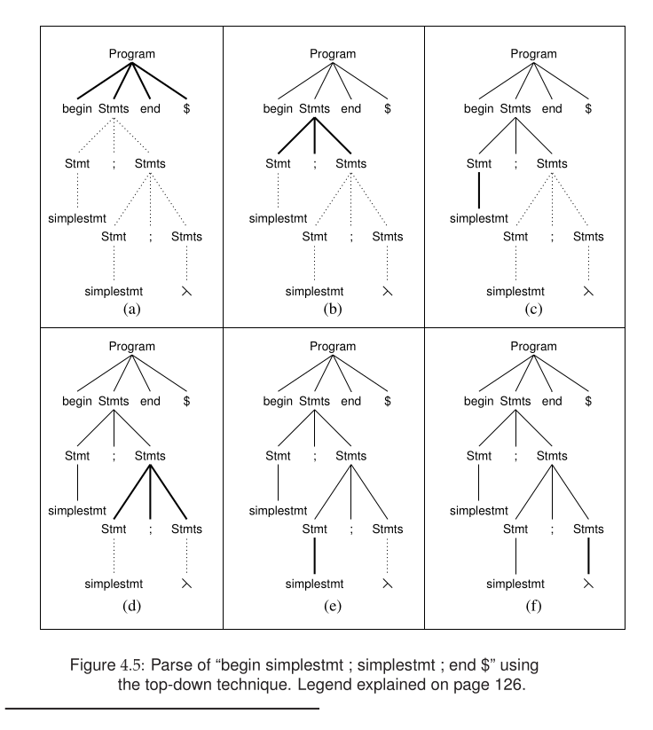

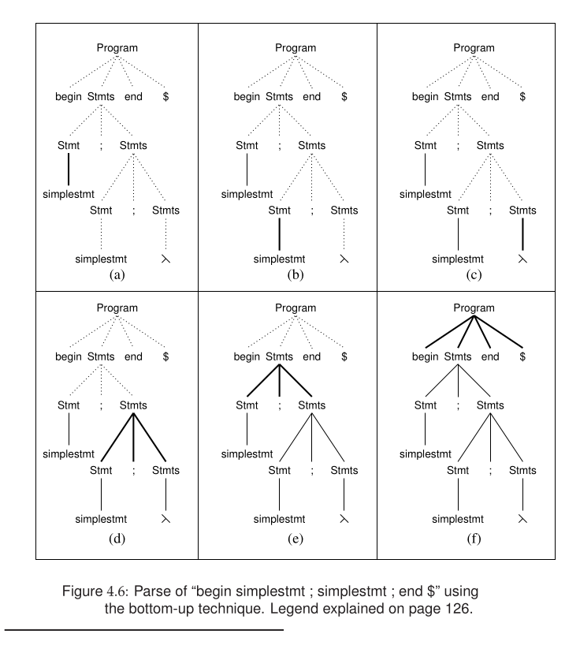

### 4.5 Grammar Analysis Algorithms

It is often necessary to analyze a grammar to determine if it is suitable for
parsing and, if so, to construct tables that can drive a parsing algorithm. In
this section, we discuss a number of important analysis algorithms that build
upon the basic concepts of grammars and derivations. These algorithms are
central to the automatic construction of parsers, as discussed in Chapters 5
and 6.

### 4.5.1 Grammar Representation

The algorithms presented in this chapter refer to a collection of utilities for
accessing and modifying representations of a CFG. The efficiency of these
algorithms is affected by the data structures upon which these utilities are
built. In this section, we examine how to represent CFGs efficiently. We
assume that the implementation programming language offers the following
constructs directly or by augmentation:
* A set is an unordered collection of distinct entities.
* A list is an ordered collection of entities. A entity can appear multiple
times in a list.
* An iterator is a construct that enumerates the contents of a set or list.
As discussed in Section 4.1, a grammar formally contains two disjoint sets of
symbols, Σ and N, which contain the grammar’s terminal and nonterminal
symbols, respectively. Grammars also contain a designated start symbol and
a set of productions. The following observations are relevant to obtaining an
efficient representation for grammars:
* Symbols are rarely deleted from a grammar.
* Transformations such as those shown in Figure 4.4 can add symbols and
productions to a grammar.
* Grammar-based algorithms typically visit all rules for a given nontermi-
nal or visit all occurrences of a given symbol in the productions.
* Most algorithms process a production’s RHS one symbol at a time.

Based on these observations, we represent a production by its LHS symbol and
a list of the symbols on its RHS. The empty string λ is not represented explicitly
as a symbol. Instead, a production A→ λ has an empty list of symbols for its
RHS. The collection of grammar utilities is as follows.

1. Grammar( S ): Creates a new grammar with start symbol S. The grammar
does not yet contain any productions.
2. Production( A, rhs ): Creates a new production for nonterminal A and returns
a descriptor for the production. The iterator rhs supplies the symbols for
the production’s RHS.
3. Productions( ): Returns an iterator that visits each of the grammar’s produc-
tions in no particular order.
4. Nonterminal( A ): Adds A to the set of nonterminals. An error occurs if A
is already a terminal symbol. The function returns a descriptor for the
nonterminal.
5. Terminal( x ): Adds x to the set of terminals. An error occurs if x is already a
nonterminal symbol. The function returns a descriptor for the terminal.
6. NonTerminals( ): Returns an iterator for the set of nonterminals.
7. Terminals( ): Returns an iterator for the set of terminal symbols.
8. IsTerminal( X ): Returns true if X is a terminal; otherwise, returns false.
9. RHS( p ): Returns an iterator for the symbols on the RHS of production p.
10. LHS( p ): Returns the nonterminal defined by production p.
11. ProductionsFor( A ): Returns an iterator that visits each production for non-
terminal A.
12. Occurrences( X ): Returns an iterator that visits each occurrence of X in the
RHS of all rules.
13. Production( y ): Returns a descriptor for the production A →α where α con-
tains the occurrence y of some vocabulary symbol.
14. Tail( y ): Accesses the symbols appearing after an occurrence. Given a symbol
occurrence y in the rule A →α y β, Tail( y ) returns an iterator for the
symbols in β.

### 4.5.2 Deriving the Empty String

One of the most common grammar computations determines which nonter-
minals can derive λ. This information is important because such nonterminals
may disappear during a parse and hence must be handled carefully. Determin-
ing if a nonterminal can derive λ is not entirely trivial because the derivation
can take more than one step:

```lex
A ⇒ BCD ⇒ BC ⇒ B ⇒ λ.
```

An algorithm to compute the productions and nonterminals that can derive λ
is shown in Figure 4.7.

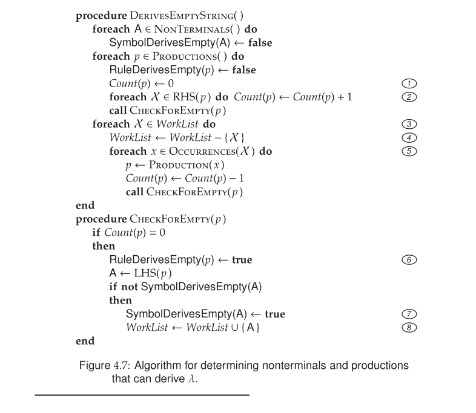

The computation utilizes a worklist at Marker 3 . A
worklist is a set that is augmented and diminished as the algorithm progresses.
The algorithm is finished when the worklist is empty. Thus, the loop at
Marker 3 must account for changes to the set WorkList. To prove termination
of algorithms that utilize worklists, it must be shown that all worklist elements
appear a finite number of times.

In the algorithm shown in Figure 4.7, the worklist contains nonterminals
that are discovered to derive λ. The integer Count(p) is initialized at Markers 1
and 2 to the number of symbols on p’s RHS. The count for any production of
the form A → λ is 0. Once a production is known to derive λ, its LHS is placed
on the worklist at Marker 8 . When a symbol is taken from the worklist at
Marker 4 , each occurrence of the symbol is visited at Marker 5 and the count
of the associated production is decremented by 1. This process continues until
the worklist is exhausted. The algorithm establishes two structures related to
derivations of λ, as follows:
• RuleDerivesEmpty(p) indicates whether or not production p can derive λ.
When every symbol in rule p’s RHS can derive λ, Marker 6 establishes
that p can derive λ.
• SymbolDerivesEmpty(A) indicates whether or not the nonterminal A can
derive λ. When any production for A can derive λ, Marker 7 establishes
that A can derive λ.
Both forms of information are useful in the grammar analysis and parsing
algorithms discussed in Chapters 4, 5, and 6.

### 4.5.3 First Sets

### FIRST Sets

FIRST sets are one of the most important concepts in parsing, especially in LL(1) parsing, predictive parsing, and parser generators. A FIRST set tells us what terminal symbols can appear first when deriving a string from a grammar symbol. Formally:

```txt
FIRST(X)
=
the set of terminals that can appear
as the first symbol in strings derived from X
```

If `X` can derive the empty string `λ`, then:

```txt
λ ∈ FIRST(X)
```

The core intuition behind FIRST sets is that they help the parser answer the question:

```txt
"If I expand this nonterminal,
what token might appear first?"
```

This information allows predictive parsers to choose productions correctly.

For example, consider the grammar:

```txt
A → aB
A → c
```

Possible derivations from `A` are:

```txt
A ⇒ aB
A ⇒ c
```

So:

```txt
FIRST(A) = { a, c }
```

For terminals, the rule is simple:

```txt
FIRST(a) = { a }
FIRST(+) = { + }
```

because a terminal derives itself.

Now consider nullable productions:

```txt
B → λ
B → b
```

Possible derivations are:

```txt
B ⇒ λ
B ⇒ b
```

So:

```txt
FIRST(B) = { b, λ }
```

The presence of `λ` becomes important when symbols appear in sequences. Suppose:

```txt
A → B c
```

and:

```txt
FIRST(B) = { b, λ }
```

If `B` disappears:

```txt
A ⇒ c
```

So:

```txt
FIRST(A) = { b, c }
```

not just `{b}`.

Now consider a more complex example:

```txt
A → B C d
B → λ | b
C → λ | c
```

First:

```txt
FIRST(B) = { b, λ }
```

so `b` belongs to `FIRST(A)`.

Because `B` is nullable, we examine `C`:

```txt
FIRST(C) = { c, λ }
```

so `c` also belongs to `FIRST(A)`.

Since both `B` and `C` can disappear, `d` may become the first symbol. Therefore:

```txt
FIRST(A) = { b, c, d }
```

The rules for computing FIRST sets are:

1. If `X` is a terminal:

```txt
FIRST(X) = { X }
```

2. If:

```txt
A → λ
```

then:

```txt
λ ∈ FIRST(A)
```

3. If:

```txt
A → X1 X2 X3 ...
```

then:
- add `FIRST(X1) - {λ}`
- if `X1` is nullable, add `FIRST(X2) - {λ}`
- continue similarly
- if all symbols are nullable, then:

```txt
λ ∈ FIRST(A)
```

Consider another example:

```txt
S → A B
A → a | λ
B → b
```

First:

```txt
FIRST(A) = { a, λ }
FIRST(B) = { b }
```

Since `A` is nullable:

```txt
S ⇒ AB
```

may begin with either:

```txt
a
```

or:

```txt
b
```

Therefore:

```txt
FIRST(S) = { a, b }
```

FIRST sets are extremely important in predictive parsing because parsers use them to decide which production rule to apply. For example:

```txt
Stmt → if Expr then Stmt
Stmt → while Expr do Stmt
```

If the parser sees:

```txt
if
```

it chooses:

```txt
Stmt → if Expr then Stmt
```

because:

```txt
if ∈ FIRST(that production)
```

FIRST sets can also be computed for entire symbol sequences. For example:

```txt
FIRST(ABC)
```

is computed by checking:
- `FIRST(A)`
- then `FIRST(B)` if `A` is nullable
- then `FIRST(C)` if necessary.

FIRST sets are closely related to FOLLOW sets:

| FIRST | FOLLOW |
|---|---|
| what can BEGIN | what can COME AFTER |
| start of derivation | symbol following nonterminal |

The big intuition is that FIRST sets predict what token may appear next. That is why LL parsers are called predictive parsers: they use FIRST sets to predict which grammar rule should be applied during parsing.

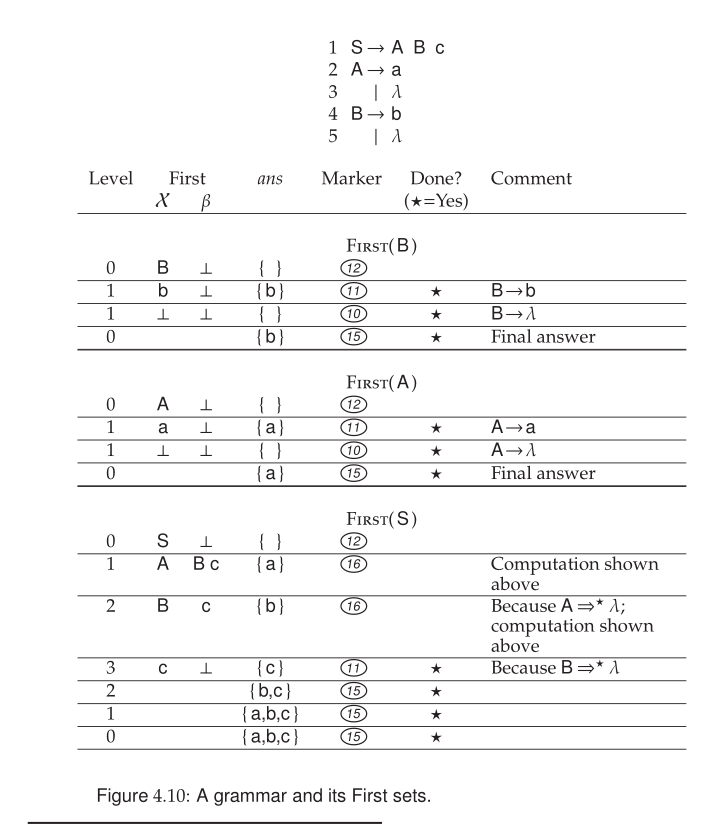


### Follow Sets

### FOLLOW Sets

A FOLLOW set tells us:

```txt
what terminals can appear immediately AFTER
a nonterminal in some derivation
```

Formally:

```txt
FOLLOW(A)
=
the set of terminals that can appear
directly after A
```

---

### Example

Grammar:

```txt
S → A b
A → a
```

Since `b` comes after `A`:

```txt
FOLLOW(A) = { b }
```

---

### End Marker `$`

If a nonterminal can appear at the end of the input:

```txt
$ ∈ FOLLOW(A)
```

where:

```txt
$ = end of input
```

Example:

```txt
S → A
```

Then:

```txt
FOLLOW(A) = { $ }
```

because `A` may end the entire sentence.

---

### More Complex Example

Grammar:

```txt
S → A B
A → a
B → b
```

Since `B` follows `A`:

```txt
FOLLOW(A) = { b }
```

And because `B` is at the end:

```txt
FOLLOW(B) = { $ }
```

---

### Why FOLLOW Sets Matter

FOLLOW sets are mainly used in predictive parsing.

They help decide:

```txt
when to use λ-productions
```

Example:

```txt
A → λ
```

Parser uses FOLLOW(A) to know when `A` should disappear.

---

### Difference Between FIRST and FOLLOW

| FIRST | FOLLOW |
|---|---|
| what can BEGIN | what can COME AFTER |
| start of derivation | symbol after nonterminal |

Example:

```txt
S → A b
A → a | λ
```

Then:

```txt
FIRST(A) = { a, λ }
FOLLOW(A) = { b }
```

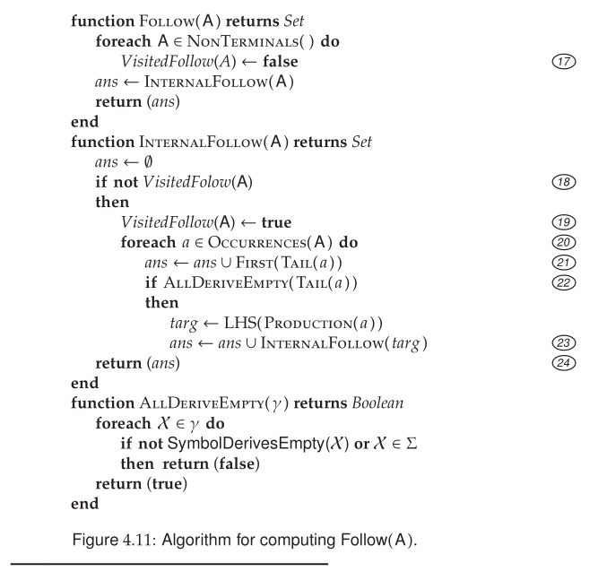

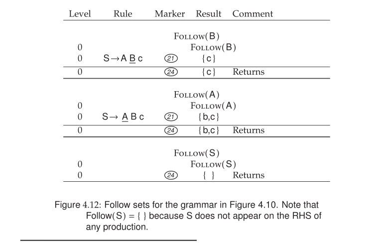

