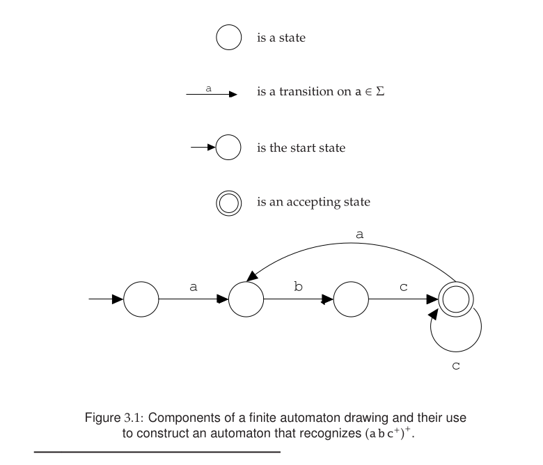
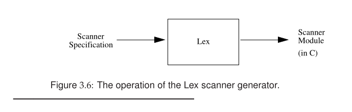
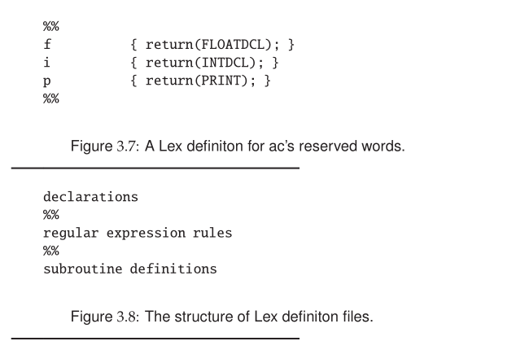
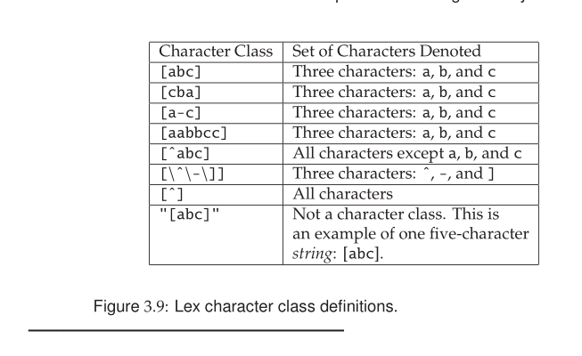
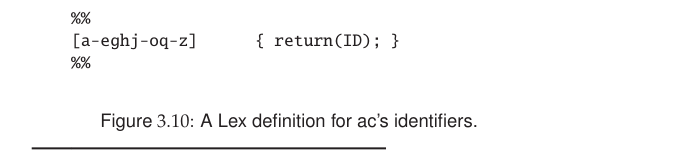
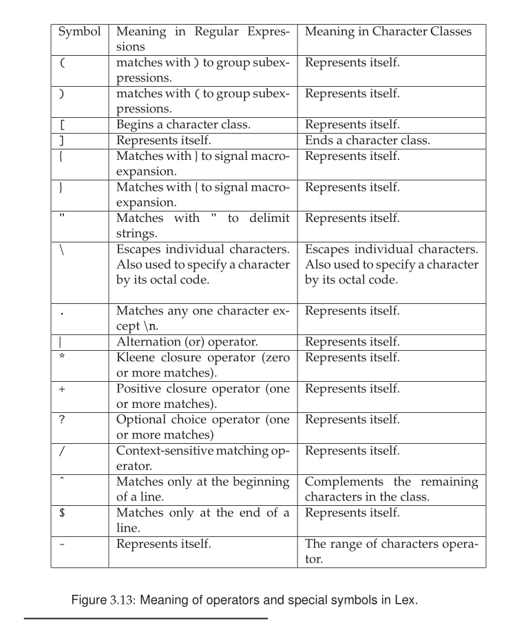

# Scanning—Theory and Practice

### 3.1 Overview of a Scanner

The primary function of a scanner is to transform a character stream into a
token stream. A scanner is sometimes called a lexical analyzer, or lexer. The
names “scanner,” “lexical analyzer,” and “lexer” are used interchangeably.
The ac scanner discussed in Chapter 2 was simple and could be coded by any
competent programmer. In this chapter, we develop a thorough and system-
atic approach to scanning that will allow us to create scanners for complete
programming languages.
We introduce formal notations for specifying the precise structure of to-
kens. At first glance, this may seem unnecessary because of the simple token
structure found in most programming languages. However, token structure
can be more detailed and subtle than one might expect. For example, consider
string constants in C, C++, and JavaTM, which are surrounded by double
quotes. The contents of the string can be any sequence of characters except the
double quote, as that would terminate the string. A double quote can appear
literally in the string only if it is preceded (escaped) by a backslash. Is this
simple definition really correct? Can a newline character appear in a string?
In C it cannot, unless it is escaped with a backslash. This notation avoids a
“runaway string” that, lacking a closing quote, matches characters intended
to be part of other tokens. While C, C++, and Java allow escaped newlines in
strings, Pascal forbids them. Ada goes further still and forbids all unprintable
characters (precisely because they are normally unreadable). Similarly, are
null (zero-length) strings allowed? C, C++, Java, and Ada allow them, but
Pascal forbids them. In Pascal, a string is a packed array of characters and
zero-length arrays are disallowed.
A precise definition of tokens is necessary to ensure that lexical rules are
clearly stated and properly enforced. Formal definitions also allow a language
designer to anticipate design flaws. For example, virtually all languages pro-
vide syntax for specifying certain kinds of rational constants. Such constants
are often specified using decimal numerals such as 0.1 and 10.01. Should
the notation .1 or 10. also be allowed? In C, C++, and Java, such notation
is permitted, but in Pascal and Ada, it is not—and for an interesting reason.
Scanners normally seek to match as many characters as possible. Thus ABC is scanned as one identifier rather than three. But now consider the character
sequence 1..10. In Pascal and Ada, this should be interpreted as a range
specifier (1 to 10). However, if we were careless in our token definitions, we
might well scan 1..10 as two constants, 1. and .10, which would lead to an
immediate (and unexpected) syntax error. The fact that two constants cannot
be adjacent is reflected in the context-free grammar (CFG), which is enforced
by the parser, not the scanner.
When a formal specification of token and program structure is given, it
is possible to examine a language for design flaws. For example, we could
analyze all pairs of tokens that can be adjacent to each other and determine
whether the two, if catenated, might be incorrectly scanned. If so, a separator
may be required. In the case of adjacent identifiers and reserved words, a
blank space (whitespace) suffices to distinguish the two tokens. Sometimes,
though, the lexical or program syntax might need to be redesigned. The point
is that language design is far more involved than one might expect, and formal
specifications allow flaws to be discovered before the design is completed.
All scanners, independent of the tokens to be recognized, perform much
the same function. Thus, writing a scanner from scratch means reimplement-
ing components that are common to all scanners; this leads to a significant
duplication of effort. The goal of a scanner generator is to limit the effort of
building a scanner to that of specifying which tokens the scanner is to recog-
nize. Using a formal notation, we tell the scanner generator what tokens we
want recognized. It is then the generator’s responsibility to produce a scan-
ner that meets our specification. Some generators do not produce an entire
scanner. Rather, they produce tables that can be used with a standard driver
program, and this combination of generated tables and standard driver yields
the desired custom scanner.
Programming a scanner generator is an example of declarative program-
ming. That is, unlike in ordinary, or procedural programming, we do not tell
a scanner generator how to scan but simply what to scan. This is a higher-level
approach and in many ways a more natural one. Much recent research in
computer science is directed toward declarative programming styles; exam-
ples are database query languages and Prolog, a “logic” programming lan-
guage. Declarative programming is most successful in limited domains, such
as scanning, where the range of implementation decisions that must be made
automatically is limited. Nonetheless, a long-standing (and as yet unrealized)
goal of computer scientists is to generate an entire production-quality compiler
automatically from a specification of the properties of the source language and
target computer.
Although our primary focus in this book is on producing correct compilers,
performance is sometimes a real concern, especially in widely used “produc-
tion compilers.” Surprisingly, even though scanners perform a simple task,
they can be significant performance bottlenecks if poorly implemented. This because scanners must wade through the text of a program character by char-
acter.
Suppose we want to implement a very fast compiler that can compile a
program in a few seconds. We will use 30,000 lines per minute (500 lines per
second) as our goal. (Compilers such as Turbo C++ achieve such speeds.) If an
average line contains 20 characters, the compiler must scan 10,000 characters
per second. On a processor that executes 10,000,000 instructions per second,
even if we did nothing but scanning, we would have only 1,000 instructions
per input character to spend. But because scanning is not the only thing
a compiler does, 250 instructions per character is more realistic. This is a
rather tight budget, considering that even a simple assignment takes several
instructions on a typical processor. Although faster processors are common
these days and 30,000 lines per minute is an ambitious speed, clearly a poorly
coded scanner can dramatically impact a compiler’s performance.


### 3.2 Regular Expressions

Regular expressions are a convenient way to specify various simple (although
possibly infinite) sets of strings. They are of practical interest because they
can specify the structure of the tokens used in a programming language. In
particular, you can use regular expressions to program a scanner generator.
Regular expressions are widely used in computer applications other than
R
utility grep uses them to define search patterns in files.
compilers. The Unix 
Unix shells allow a restricted form of regular expressions when specifying file
lists for a command. Most editors provide a “context search” command that
enables you to specify desired matches using regular expressions.
A set of strings defined by regular expressions is called a regular set. For
purposes of scanning, a token class is a regular set whose structure is defined
by a regular expression. A particular instance of a token class is sometimes
called a lexeme; however, we simply call a string in a token class an instance
of that token. For example, we call the string abc an identifier if it matches the
regular expression that defines the set of valid identifier tokens.
Our definition of regular expressions starts with a finite character set, or
vocabulary (denoted Σ). This vocabulary is normally the character set used
by a computer. Today, the ASCII character set, which contains 128 characters,
is very widely used. Java, however, uses the Unicode character set. This set
includes all of the ASCII characters as well as a wide variety of other characters.
An empty, or null, string is allowed (denoted λ). This symbol represents an
empty buffer in which no characters have yet been matched. It also represents
an optional part of a token. Thus, an integer literal may begin with a plus or
minus, or, if it is unsigned, it may begin with λ.

Strings are built from characters in the character set Σ via catenation (that is,
by joining individual characters to form a string). As characters are catenated
to a string, it grows in length. For example, the string do is built by first
catenating d to λ and then catenating o to the string d. The null string, when
catenated with any string s, yields s. That is, s λ ≡ λ s ≡ s. Catenating λ to a
string is like adding 0 to an integer—nothing changes.
Catenation is extended to sets of strings as follows. Let P and Q be sets of
strings. The symbol ∈ represents set membership. If s1 ∈ P and s2 ∈ Q, then
string s1 s2 ∈ (P Q). Small finite sets are conveniently represented by listing
their elements, which can be individual characters or strings of characters.
Parentheses are used to delimit expressions, and |, the alternation operator, is
used to separate alternatives. For example, D, the set of the ten single digits,
is defined as D = (0 | 1 | 2 | 3 | 4 | 5 | 6 | 7 | 8 | 9). In this text, we often
use abbreviations such as (0 | . . . | 9) rather than enumerate a complete list of
alternatives. The . . . symbol is not part of our regular expression notation.
A meta-character is any punctuation character or regular expression oper-
ator. A meta-character must be quoted when used as an ordinary character in
order to avoid ambiguity. (Any character or string may be quoted, but unnec-
essary quotation is avoided to enhance readability.) The following six symbols
are meta-characters: ( ) ’ * + |. The expression ( ’(’ | ’)’ | ; | , ) defines four single
character tokens (left parenthesis, right parenthesis, semicolon, and comma)
that we might use in a programming language. The parentheses are quoted
to show they are meant to be individual tokens and not delimiters in a larger
regular expression.
Alternation can be extended to sets of strings. Let P and Q be sets of
strings. Then string s ∈ (P | Q) if, and only if, s ∈ P or s ∈ Q. For example, if
LC is the set of lowercase letters and UC is the set of uppercase letters, then
(LC | UC) denotes the set of all letters (in either case).
Large (or infinite) sets are conveniently represented by operations on finite
sets of characters and strings. Catenation and alternation may be used. A third
operation, Kleene closure, as defined below, is also allowed. The operator 
is the postfix Kleene closure operator. For example, let P be a set of strings. Then
P represents all strings formed by the catenation of zero or more selections
(possibly repeated) from P. (Zero selections are represented by λ.) For exam-
ple, LC is the set of all words composed only of lowercase letters and of any
length (including the zero-length word, λ).
Precisely stated, a string s ∈ P if, and only if, s can be broken into zero or
more pieces: s = s1 s2 ...sn such that each si ∈ P(n ≥ 0, 1 ≤ i ≤ n). We explicitly
allow n = 0 so that λ is always in P .
Now that we have introduced the operators used in regular expressions,
we can define regular expressions as follows:
* ∅ is a regular expression denoting the empty set (the set containing no
strings). ∅ is rarely used but is included for completeness.
* λ is a regular expression denoting the set that contains only the empty
string. This set is not the same as the empty set because it does contain
one element.
* The symbol s is a regular expression denoting { s }: a set containing the
single symbol s ∈ Σ.
* If A and B are regular expressions, then A | B, AB, and A are also regular
expressions. They denote, respectively, the alternation, catenation, and
Kleene closure of the corresponding regular sets.

Each regular expression denotes a regular set. Any finite set of strings can be
represented by a regular expression of the form (s1 | s2 | ... | sk ). Thus, the
reserved words of ANSI C can be defined as (auto | break | case | ...).
The following additional operations are also useful. They are not strictly
necessary because their effect can be obtained (perhaps somewhat clumsily)
using the three standard regular operators (alternation, catenation, and Kleene
closure):
* P+ , sometimes called positive closure, denotes all strings consisting of
one or more strings in P catenated together: P = (P+ | λ) and P+ = P P .
For example, the expression (0 | 1)+ is the set of all strings containing one
or more bits.
* If A is a set of characters, Not(A) denotes (Σ - A), that is, all characters
in Σ not included in A. Since Not(A) can never be larger than Σ and
Σ is finite, Not(A) must also be finite. Therefore it is regular. Not(A)
does not contain λ because λ is not a character (it is a zero-length string).
As an example, Not(Eol) is the set of all characters excluding Eol (the
end-of-line character; in Java or C, \n).
It is possible to extend Not() to strings, rather than just Σ. If S is a set of
strings, we can define Not(S) to be (Σ - S), that is, the set of all strings
except those in S. Although Not(S) is usually infinite, it also is regular if
S is regular (Exercise 18).
* If k is a constant, then the set Ak represents all strings formed by catenat-
ing k (possibly different) strings from A. That is, Ak = (AAA ...) (k copies).
Thus, (0 | 1)32 is the set of all bit strings exactly 32 bits long.

### 3.3 Examples

We next provide some examples that use regular expressions to specify some
common programming language tokens. In these definitions, D is the set of
the ten single digits and L is the set of all upper- and lower-case letters.

* A Java or C++ single-line comment that begins with // and ends with
Eol can be defined as

```C
Comment = // (Not(Eol)) Eol
```
This regular expression says that a comment begins with two slashes and
ends at the first end-of-line. Within the comment, any sequence of char-
acters is allowed that does not contain an end-of-line. (This guarantees
that the first end-of-line we see ends the comment.)

* A fixed-decimal literal (for example, 12.345) can be defined as
```C
Lit = D+ .D+
```
One or more digits must be on both sides of the decimal point, so .12
and 35. are excluded.

* An optionally signed integer literal can be defined as
```C
IntLiteral = (’+’ | − | λ ) D+
```
An integer literal is one or more digits preceded by a plus, minus, or no
sign at all (λ). So that the plus sign is not confused with the positive
closure operator, it is quoted.

* A more complicated example is a comment delimited by ## markers,
which allows single #’s within the comment body:
```C
Comment2 = ## ((# | λ) Not(#)) ##
```
Any **#** that appears within this comment’s body must be followed by a
non-**#** so that a premature end-of-comment marker, **##**, is not found.

All finite sets are regular. However, some (but not all) infinite sets are regular.
For example, consider the set of balanced brackets of the form [ [ [ . . . ] ] ].
This set is defined formally as {[m ]m | m ≥1}, and it can be proven that this set
is not regular (Exercise 14). The problem is that any regular expression that
tries to define it either does not get all balanced nestings or includes extra,
unwanted strings.
On the other hand, it is straightforward to write a CFG that defines bal-
anced brackets precisely. Moreover, all regular sets can be defined by CFGs.
Thus, the bracket example shows that CFGs are a more powerful descrip-
tive mechanism than regular expressions. Regular expressions are, however,
quite adequate for specifying token-level syntax. Moreover, for every regu-
lar expression we can create an efficient device, called a finite automaton, that
recognizes exactly those strings that match the regular expression’s pattern.



### 3.4 Finite Automata and Scanners

A finite automaton (FA) can be used to recognize the tokens specified by a
regular expression. An FA (plural: finite automata) is a simple, idealized
computer that recognizes strings as belonging to regular sets. An FA consists
of the following:
* A finite set of states
* A finite vocabulary, denoted Σ
* A set of transitions (or moves) from one state to another, labeled with
characters in Σ
* A special state called the start state
* A subset of the states called the accepting, or final, states

These components of an FA can be represented graphically as shown in Fig-
ure 3.1.
An FA also can be represented graphically using a transition diagram,
composed of the components shown in Figure 3.1. Given a transition diagram,
we begin at the start state. If the next input character matches the label on a
transition from the current state, then we go to the state to which it points.
If no move is possible, then we stop. If we finish in an accepting state, the
sequence of characters read forms a valid token; otherwise, a valid token has
not been seen. In the transition diagram shown in Figure 3.1, the valid tokens
are the strings described by the regular expression (a b c+ )+ .
As an abbreviation, a transition may be labeled with more than one char-
acter (for example, Not(c)). The transition may be taken if the current input
character matches any of the characters labeling the transition.

### 3.4.1 Deterministic Finite Automata

An FA that always has a unique transition (for a given state and character) is
a deterministic finite automaton (DFA). DFAs are simple to program and are
often used to drive a scanner. A DFA is conveniently represented in a computer
by a transition table. A transition table, T, is a two-dimensional array indexed
by a DFA state and a vocabulary symbol. Table entries are either a DFA state
or an error flag (often represented as a blank table entry). If we are in state s
and read character c, then T[s,c] will be the next state we visit, or T[s,c] will
contain an error flag indicating that c cannot extend the current token. For
example, the regular expression
```C
/ / (Not(Eol)) Eol
```

which defines a Java or C++ single-line comment, might be recognized by the
DFA shown in Figure **3.2(a)**

.png)

The corresponding transition table is shown in
Figure **3.2(b)**.

.png)

A full transition table will contain one column for each character. To
save space, table compression is sometimes utilized. In that case, only nonerror
entries are explicitly represented in the table. This is done by using hashing or
linked structures [CLRS01].
Any regular expression can be translated into a DFA that accepts (as valid
tokens) the set of strings denoted by the regular expression. This transla-
tion can be done manually by a programmer or automatically by a scanner
generator.

### Coding the DFA

A DFA can be coded in one of two forms:

1. Table-driven
2. Explicit control

In the table-driven form, the transition table that defines a DFA’s actions is
explicitly represented in a runtime table that is “interpreted” by a driver pro-
gram. In the explicit control form, the transition table that defines a DFA’s
actions appears implicitly as the control logic of the program. Typically, indi-
vidual program statements correspond to distinct DFA states. For example,
suppose CurrentChar is the current input character. End-of-file is represented
by a special character value, Eof. Using the DFA for the Java comments illus-
trated previously, the two approaches would produce the programs illustrated
in Figures 3.3 and 3.4.
The table-driven form is commonly produced by a scanner generator; it is
token independent. It uses a simple driver that can scan any token, provided
the transition table is properly stored in T. The explicit control form may be
produced automatically or by hand. The token being scanned is "hardwired"
into the code. This form of a scanner is usually easy to read and often is more
efficient, but it is specific to a single token definition.
The following are two more examples of regular expressions and their
corresponding DFAs:

```C
/* Assume CurrentChar contains the first character to be scanned */
State ← StartState
while true do
NextState ← T[State, CurrentChar]
if NextState = error
then break
State ← NextState
CurrentChar ← read( )
if State ∈ AcceptingStates
then /* Return or process the valid token */
else /* Signal a lexical error */
```
Figure 3.3: Scanner driver interpreting a transition table.
1. A Fortran-like real literal (which requires either digits on one or both
sides of a decimal point or just a string of digits) can be defined as
RealLit = (D+ (λ | . )) | (D . D+ )
which corresponds to the DFA shown in Figure 3.5(a).
2. Another form of identifier consists of letters, digits, and underscores. It
begins with a letter and allows no adjacent or trailing underscores. It
may be defined as

ID = L (L | D) ( (L | D)+ )
This definition includes identifiers such as sum or unit cost but ex-
cludes one, two , and grand total. The corresponding DFA is shown
in Figure 3.5(b).

### Transducers

The scanners shown in Figures 3.3 and 3.4 begin processing characters at some
point in the input stream. They finish either by accepting the token for which
they are programmed or by signaling a lexical error. It is often useful for a
scanner to process the input stream not only to recognize tokens but also to
associate a semantic value with the discovered tokens. For example, a scanner
can find that the input 431 is an integer constant, but it is useful to associate
the value of 431 with that token.
An FA that analyzes or transforms its input beyond simply accepting to-
kens is called a transducer. The FAs shown in Figure 3.5 recognize a particular
kind of constant and identifier. A transducer that recognizes constants might be responsible for developing the appropriate bit pattern to represent the con-
stant. A transducer that processes identifiers may only have to retain the name
of the identifier. For some languages, the scanner may be further required to
classify the type of the identifier by referring to a symbol table.
A scanner can be turned into a transducer by the appropriate insertion of
actions based on state transitions. Consider the table-driven scanner shown
in Figure 3.3. The transition table shown in Figure 3.2(b) expresses the next
state in terms of the current state and input symbol. An action table can be
formulated that parallels the transition table. Based on the current state and
input symbol, the action table encodes the action that should be performed as
the FA makes the corresponding transition. The encoding could be formulated
as an integer that is then demultiplexed by a switch statement to choose an
appropriate sequence of actions. A more object-oriented approach would
encode the action as an object instance containing a method that performs the
action.


### 3.5 The Lex Scanner Generator

As a case study in the design of scanner generation tools, we first discuss a
very popular scanner generator, Lex. We then briefly discuss several other
scanner generators.
Lex was developed by M. E. Lesk and E. Schmidt of AT&T Bell Laborato-
ries. It is used primarily with programs written in C or C++ running under
the Unix operating system. Lex produces an entire scanner module, coded in
C, that can be compiled and linked with other compiler modules. A complete
description of Lex and its usage can be found in [LS83] and [Joh83]. Flex [Pax]
is a widely used, freely distributed reimplementation of Lex that produces
faster and more reliable scanners. JFlex is a similar tool for use with Java [KD].
Valid Lex scanner specifications may, in general, be used with Flex without
modification.
The operation of Lex is illustrated in Figure 3.6. The steps are as follows:
1. A scanner specification that defines the tokens to be scanned and how
they are to be processed is presented to Lex.
2. Lex generates a complete scanner coded in C.
3. This scanner is compiled and linked with other compiler components to
create a complete compiler.

Using Lex saves a great deal of effort when programming a scanner. Many
low-level details of the scanner (reading characters efficiently, buffering them,
matching characters against token definitions, and so on) need not be explicitly programmed. Rather, we can focus on the character structure of tokens and
how they are to be processed.
The primary purpose of this section is to show how regular expressions
and related information are presented to scanner generators. A helpful way
to learn Lex is to start with the simple examples presented here and then
gradually generalize them to solve the problem at hand. To inexperienced
readers, Lex’s rules may seem unnecessarily complex. It is best to keep in
mind that the key is always the specification of tokens as regular expressions.
The rest is there simply to increase efficiency and handle various details.



### 3.5.1 Defining Tokens in Lex

Lex’s approach to scanning is simple. It allows the user to associate regular
expressions with commands coded in C (or C++). When input characters that
match the regular expression are read, the associated commands are executed.
Users of Lex do not specify how to match tokens, except by providing the
regular expressions. The associated commands specify what should be done
when a particular token is matched.
Lex creates a file lex.yy.c that contains an integer function yylex(). This
function is normally called from the parser whenever another token is needed.
The value that yylex() returns is the token code of the token scanned by
Lex. Tokens such as whitespace are deleted simply by having their associated
command not return anything. Scanning continues until a command with a
return in it is executed.
Figure 3.7 illustrates a simple Lex definition for the three reserved words—
f, i, and p—of the ac language introduced in Chapter 2. When a string
matching any of these three reserved keywords is found, then the appropriate
token code is returned. It is vital that the token codes that are returned when a
token is matched are identical to those expected by the parser. If they are not,
then the parser will not see the same token sequence produced by the scanner.
This will cause the parser to generate false syntax errors based on the incorrect
token stream it sees.
It is standard for the scanner and parser to share the definition of token
codes to guarantee that consistent values are seen by both. The file y.tab.h, produced by the yacc parser generator (see Chapter 7), is often used to de-
fine shared token codes. A Lex token specification consists of three sections
delimited by the pair %%. The general form of a Lex specification is shown in
Figure 3.8.
In the simple example shown in Figure 3.7, we use only the second sec-
tion, in which regular expressions and corresponding C code are specified.
The regular expressions are simple single-character strings that match only
themselves. The code executed returns a constant value representing the ap-
propriate ac token.
We could quote the strings representing the reserved keywords (f, i, or
p), but since these strings contain no delimiters or operators, quoting them
is unnecessary. If you want to quote such strings to avoid any chance of
misinterpretation, that is allowed in Lex.



### 3.5.2 The Character Class

Our specification so far is incomplete. None of the other tokens in ac have
been correctly handled, particularly identifiers and numbers. To do this, we
introduce a useful concept: the character class. A character class is a set of
characters treated identically in a token definition. Thus, in the definition of
an ac identifier, all letters (except f, i, and p) form a class since any of them
can be used to form an identifier. Similarly, in a number, any of the ten digits
characters can be used.



Using character classes, we can easily define ac identifiers, as shown in
Figure 3.10. The character class includes the characters a through e, g and h, j
through o, and finally q through z. We can concisely represent the 23 characters
that may form an ac identifier without having to enumerate them all.



### 3.5.3 Using Regular Expressions to Define Tokens

#### Overview

Section **3.5.3** of *Crafting a Compiler* explains how **regular expressions** are used to define the tokens of a programming language when using a scanner generator such as **Lex**.

A scanner (also called a lexer or lexical analyzer) is responsible for:
- reading raw source-code characters
- grouping characters into meaningful units called **tokens**
- passing those tokens to the parser

Instead of manually writing scanner logic using many `if` statements and loops, Lex allows token patterns to be specified declaratively using **regular expressions**.

---

#### The Role of the Scanner

The scanner is the first major phase of a compiler.

Input:

```c
x = a + 5;
```

Scanner output:

```text
id assign id plus inum
```

The scanner must recognize:
- identifiers
- keywords
- numbers
- operators
- punctuation

To do this efficiently, scanners use regular expressions.

---

#### What is a Regular Expression?

A regular expression (regex) is a compact notation used to describe patterns of characters.

Example:

```text
[0-9]+
```

means:
> one or more digits

Matches:

```text
5
42
123456
```

---

#### Why Regular Expressions Are Useful

Without regex-based scanners, compiler writers would manually write code like:

```c
if(isdigit(ch)) {
    while(isdigit(ch)) ...
}
```

for every token type.

This becomes:
- repetitive
- difficult to maintain
- error-prone

Regular expressions simplify scanner construction by describing token patterns declaratively.

---

#### Lex Rule Structure

In Lex, token rules have this form:

```text
regular_expression      action
```

Meaning:

> “If the input matches this regex, perform this action.”

---

#### Example 1 — Identifiers

Suppose identifiers in a language:
- begin with a letter
- followed by letters or digits

Regular expression:

```text
[a-zA-Z][a-zA-Z0-9]*
```

Lex rule:

```lex
[a-zA-Z][a-zA-Z0-9]*    return(ID);
```

Matches:

```text
x
sum
abc123
counter7
```

All produce token:

```text
ID
```

---

#### Example 2 — Integer Numbers

Regular expression:

```text
[0-9]+
```

Lex rule:

```lex
[0-9]+    return(INUM);
```

Matches:

```text
5
42
1000
```

Produces:

```text
INUM
```

---

#### Example 3 — Floating-Point Numbers

Regular expression:

```text
[0-9]+"."[0-9]+
```

Matches:

```text
3.14
0.5
12.0
```

Lex rule:

```lex
[0-9]+"."[0-9]+    return(FNUM);
```

---

#### Example 4 — Operators

Lex rules:

```lex
"+"    return(PLUS);
"-"    return(MINUS);
"="    return(ASSIGN);
```

Input:

```text
a = b + 5
```

Scanner output:

```text
ID ASSIGN ID PLUS INUM
```

---

#### Keywords vs Identifiers

A keyword like:

```text
if
```

also matches the identifier regex.

How does Lex distinguish them?

Lex uses:
1. longest match
2. if tied → first rule wins

Example:

```lex
if                      return(IF);
[a-zA-Z][a-zA-Z0-9]*   return(ID);
```

Input:

```text
if
```

becomes:

```text
IF
```

because keyword rule appears first.

---

#### Important Regular Expression Operators

| Operator | Meaning |
|---|---|
| `*` | zero or more |
| `+` | one or more |
| `?` | optional |
| `|` | OR |
| `[]` | character class |
| `()` | grouping |

---

#### Examples of Regex Operators

#### Kleene Star `*`

```text
(a|b)*
```

Matches:

```text
""
a
ab
baba
```

---

#### One or More `+`

```text
[0-9]+
```

Matches:

```text
5
42
123
```

---

#### Character Classes `[]`

```text
[a-z]
```

means:
> any lowercase letter

```text
[0-9]
```

means:
> any digit

---

#### How Lex Works Internally

The chapter also introduces an important theoretical idea:

> Regular expressions are automatically transformed into finite automata.

The process:

```text
Regular Expression
        ↓
NFA (Nondeterministic Finite Automaton)
        ↓
DFA (Deterministic Finite Automaton)
        ↓
Generated Scanner Code
```

This is why scanner generators can automatically produce efficient scanners.

---

#### Relationship Between Regex and Finite Automata

One of the most important compiler-theory results is:

> Regular expressions and finite automata are equivalent.

Meaning:
- every regex can be converted into a DFA/NFA
- every DFA/NFA can be represented as a regex

This theoretical equivalence is the foundation of scanner generators like Lex.

---

#### Difference Between Scanning and Parsing

A critical compiler-design distinction:

| Phase | Uses |
|---|---|
| Scanning | Regular Expressions |
| Parsing | Context-Free Grammars (CFGs) |

---

#### Scanning recognizes tokens

Example:

```text
x
+
5
```

becomes:

```text
ID PLUS INUM
```

---

#### Parsing recognizes structure

Grammar:

```text
Expr → Expr + Expr
```

Parser determines:
- whether the tokens form a valid expression
- the syntactic structure of the program

---

#### Complete Example

Suppose source code is:

```c
sum = total + 25
```

Scanner rules:

```lex
[a-zA-Z][a-zA-Z0-9]*    return(ID);
[0-9]+                  return(INUM);
"+"                     return(PLUS);
"="                     return(ASSIGN);
```

Scanner output:

```text
ID ASSIGN ID PLUS INUM
```

Parser then applies CFG rules such as:

```text
Stmt → id assign Expr
Expr → Expr plus Expr
```

to verify syntax.

---

#### Advantages of Regex-Based Scanners

#### Simplicity

Token patterns are concise and easy to read.

---

#### Maintainability

Adding new tokens only requires adding new regex rules.

---

#### Automatic Scanner Generation

Lex generates optimized scanner code automatically.

---

#### Portability

Regex specifications are machine-independent.

---

#### Limitations of Regular Expressions

Regular expressions cannot describe recursive structures.

For example, regex cannot properly describe arbitrarily nested parentheses:

```text
((a+b)*(c+d))
```

Nested structures require:
- CFGs
- parsers

Thus:
- regex handles token recognition
- CFG handles syntax structure

---

#### Key Takeaways

- Regular expressions define token patterns.
- Lex uses regex rules to generate scanners automatically.
- Scanners convert characters into tokens.
- Lex internally converts regex into finite automata.
- Regular expressions are suitable for lexical structure, not recursive syntax.
- Parsing requires CFGs after scanning is complete.

---

#### Final Summary

Section 3.5.3 explains how regular expressions are used in Lex to define the lexical tokens of a programming language. Instead of manually implementing scanners, compiler writers describe token patterns declaratively using regex rules. Lex then transforms these regular expressions into finite automata and automatically generates efficient scanner code. The chapter demonstrates how identifiers, numbers, keywords, and operators can all be recognized through regular expressions, while also emphasizing the distinction between lexical analysis using regex and syntactic analysis using context-free grammars.

### Chapter 3.5.4 — Character Processing Using Lex

#### Overview

Section **3.5.4 — Character Processing Using Lex** explains how a Lex-generated scanner actually processes input characters while recognizing tokens.

Earlier sections explained:
- how tokens are described using regular expressions

This section explains:
- how Lex executes those rules on real input streams
- how scanners manipulate characters
- how matched text is accessed and processed

The chapter moves from:
> “What token patterns look like”

to:
> “How the scanner processes characters while matching those patterns.”

---

#### The Big Idea

A Lex scanner continuously:
1. reads characters from the input stream
2. matches them against regular expressions
3. performs actions associated with the matched token
4. returns tokens to the parser

Conceptually:

```text
Input Characters
        ↓
Lex Scanner
        ↓
Regex Matching
        ↓
Actions Executed
        ↓
Tokens Returned
```

---

#### Structure of a Lex Program

A Lex file usually contains three sections:

```lex
definitions
%%
rules
%%
user code
```

---

#### Example Lex Program

```lex
%{
####include <stdio.h>
%}

%%
[0-9]+      printf("INTEGER\n");
[a-zA-Z]+   printf("IDENTIFIER\n");
"+"         printf("PLUS\n");
%%

int main() {
    yylex();
}
```

---

#### What Happens Internally?

Suppose input is:

```text
x + 25
```

The scanner:
1. reads `x`
2. matches identifier regex
3. executes associated action
4. reads `+`
5. matches plus operator
6. reads `25`
7. matches integer regex

Output:

```text
IDENTIFIER
PLUS
INTEGER
```

---

#### Important Lex Variables

Section 3.5.4 introduces important built-in Lex variables and functions used for character processing.

---

#### `yytext`

`yytext` stores:
> the actual text matched by the current regular expression

Example:

```lex
[0-9]+   printf("%s\n", yytext);
```

Input:

```text
12345
```

Output:

```text
12345
```

So:
- regex matches token
- `yytext` contains the matched characters

---

#### Example Using `yytext`

```lex
[a-zA-Z][a-zA-Z0-9]* {
    printf("Identifier = %s\n", yytext);
}
```

Input:

```text
counter7
```

Output:

```text
Identifier = counter7
```

---

#### `yyleng`

`yyleng` stores:
> length of matched text

Example:

```lex
[a-zA-Z]+ {
    printf("Length = %d\n", yyleng);
}
```

Input:

```text
compiler
```

Output:

```text
Length = 8
```

---

#### Ignoring Characters

Often scanners ignore:
- spaces
- tabs
- newlines

Lex rule:

```lex
[ \t\n]+    ;
```

Meaning:
- match whitespace
- do nothing

This is very common in lexical analysis.

---

#### Character-by-Character Processing

Although regex describes patterns abstractly, internally Lex scanners process input one character at a time.

Example:

Input:

```text
abc123
```

Scanner behavior:

```text
read 'a'
read 'b'
read 'c'
read '1'
read '2'
read '3'
```

then determines:
- longest valid token

---

#### Longest Match Rule

Lex always chooses:
1. longest possible match
2. first rule if ties occur

---

#### Example

Rules:

```lex
if                      return(IF);
[a-zA-Z][a-zA-Z0-9]*   return(ID);
```

Input:

```text
if
```

Both rules match.

Lex chooses:
```text
IF
```

because:
- same length
- first rule wins

---

#### Another Example

Input:

```text
integer123
```

Scanner keeps reading until:
- regex no longer extends

Result:

```text
ID(integer123)
```

not:

```text
ID(integer)
INUM(123)
```

because Lex prefers the longest valid token.

---

#### Character Pushback

Sometimes scanners read too far.

Lex provides mechanisms like:
- `unput()`
- backing up input

This allows characters to be returned to the input stream.

---

#### Example Problem

Suppose scanner reads:

```text
123abc
```

while trying to scan a number.

Scanner may:
- stop at `a`
- push `a` back
- return `123` as integer token

Then next scan starts at:
```text
abc
```

---

#### Start States

More advanced Lex scanners use:
- scanner states
- context-sensitive scanning

Example:
- scanning comments
- scanning strings

Scanner behavior changes depending on current state.

---

#### Example: Comment Processing

Suppose language supports:

```c
/* comment */
```

Scanner may enter:
```text
COMMENT_STATE
```

and ignore all characters until:
```text
*/
```

appears.

---

#### End-of-File Processing

Lex scanners also detect:
- EOF (end of file)

Example:

```lex
<<EOF>>    return(EOF_TOKEN);
```

---

#### Typical Scanner Workflow

```text
Source Program
      ↓
Characters read
      ↓
Regex matching
      ↓
Matched text stored in yytext
      ↓
Action executed
      ↓
Token returned
```

---

#### Example Complete Scanner

```lex
%%
[0-9]+ {
    printf("Integer: %s\n", yytext);
}

[a-zA-Z][a-zA-Z0-9]* {
    printf("Identifier: %s\n", yytext);
}

"+" {
    printf("PLUS\n");
}

[ \t\n]+ ;

. {
    printf("Unknown character\n");
}
%%
```

---

#### Example Execution

Input:

```text
sum + 25
```

Output:

```text
Identifier: sum
PLUS
Integer: 25
```

---

#### Error Handling

Lex scanners usually include a catch-all rule:

```lex
. {
    printf("Lexical Error\n");
}
```

The dot `.` means:
> any single unmatched character

This handles illegal symbols.

---

#### Relation to Compiler Design

This chapter shows how:
- theoretical regex definitions
- become practical scanners

It bridges:
- automata theory
- real compiler implementation

---

#### Key Concepts Introduced

| Concept | Purpose |
|---|---|
| `yytext` | matched token text |
| `yyleng` | token length |
| longest match | token selection |
| ignored patterns | whitespace/comments |
| character pushback | correcting over-read |
| start states | context-sensitive scanning |

---

#### Main Insight

Regular expressions describe:
> *what tokens look like*

Character processing explains:
> *how Lex actually reads and manages characters while recognizing those tokens.*

---



#### Final Summary

Section 3.5.4 explains how Lex-generated scanners process input characters while recognizing tokens defined by regular expressions. The chapter introduces important scanner mechanisms such as `yytext`, `yyleng`, longest-match behavior, whitespace handling, character pushback, and scanner states. It demonstrates how Lex scanners read character streams incrementally, match token patterns efficiently using finite automata, and execute actions associated with recognized tokens. The section connects the theory of regular expressions with the practical implementation details of lexical analysis in real compilers.

### 3.6 Other Scanner Generators

Lex is certainly the most widely known and widely available scanner generator
because it is distributed as part of the Unix system. Even after years of use,
it still has bugs, however, and produces scanners too slow to be used in
production compilers. This section briefly discussed some of the alternatives
to Lex, including Flex, JLex, Alex, Lexgen, GLA, and re2c.
It has been shown that Lex can be improved so that it is always faster than
a handwritten scanner [Jac87]. This is done using Flex, a widely used, freely distributed Lex clone. It produces scanners that are considerably faster than
the ones produced by Lex. It also provides options that allow the tuning of the
scanner size versus its speed, as well as some features that Lex does not have
(such as support for 8-bit characters). If Flex is available on your system, you
should use it instead of Lex.
Lex also has been implemented in languages other than C. JFlex [KD] is a
Lex-like scanner generator written in Java that generates Java scanner classes.
It is of particular interest to people writing compilers in Java. Versions of Lex
are also available for Ada and ML.
An interesting alternative to Lex is GLA (Generator for Lexical Analyz-
ers) [Gra88]. GLA takes a description of a scanner based on regular expressions
and a library of common lexical idioms (such as “Pascal comment”) and pro-
duces a directly executable (that is, not transition table-driven) scanner written
in C. GLA was designed with both ease of use and efficiency of the generated
scanner in mind. Experiments show it to be typically twice as fast as Flex
and only slightly slower than a trivial program that reads and “touches” each
character in an input file. The scanners it produces are more than competitive
with the best hand-coded scanners.
Another tool that produces directly executable scanners is re2c [BC93].
The scanners it produces are easily adaptable to a variety of environments and
yet scanning speed is excellent.
Scanner generators are usually included as parts of complete suites of
compiler development tools. Other than those already mentioned, some of the
most widely used and highly recommended scanner generators are DLG (part
of the PCCTS tools suite, [Par97]), CoCo/R [Moe90], an integrated scanner/parser
generator, and Rex [GE91], part of the Karlsruhe/CoCoLab Cocktail Toolbox.

### Chapter 3.7 — Practical Considerations of Building Scanners

from *Crafting a Compiler* :contentReference[oaicite:0]{index=0}

Chapter 3.7 is where compiler theory starts becoming real compiler engineering.

Earlier sections taught:
- regular expressions
- DFA/NFA
- Lex
- token recognition

But in real compilers, scanners face many practical problems:
- huge identifiers
- comments
- lookahead
- performance
- error recovery
- source-file management

This chapter explains those real-world issues.

---

### Topics in Chapter 3.7

| Section | Topic | Core Idea |
|---|---|---|
| 3.7.1 | Processing Identifiers and Literals | Handling names and constants |
| 3.7.2 | Using Compiler Directives and Listing Source Lines | Managing source files and directives |
| 3.7.3 | Terminating the Scanner | EOF handling |
| 3.7.4 | Multicharacter Lookahead | Reading ahead safely |
| 3.7.5 | Performance Considerations | Making scanners fast |
| 3.7.6 | Lexical Error Recovery | Recovering from bad input |

---

### 3.7.1 Processing Identifiers and Literals

This section discusses how scanners handle:
- identifiers
- numbers
- strings
- literals

---

#### Example

Input:

```c
count = 123;
```

Scanner must distinguish:

| Token | Meaning |
|---|---|
| `count` | identifier |
| `123` | integer literal |

---

#### Important Idea

Recognizing a token is NOT enough.

The scanner must also:
- store the token’s value
- attach semantic information

---

#### Example

For:

```c
12345
```

scanner creates:

```text
Token Type = INUM
Value = 12345
```

---

#### Identifier Processing

Identifiers are often stored in:
- symbol tables

Example:

```c
temperature
```

Scanner:
1. recognizes identifier
2. inserts/finds entry in symbol table
3. returns reference/index

---

#### Why?

Because later phases need:
- variable names
- types
- scope information

---

#### String Literals

Example:

```c
"hello world"
```

Scanner must:
- process quotes
- store string contents
- handle escapes

Example:

```c
"\n"
```

means newline character.

---

#### Numeric Literals

Scanners may process:
- decimal
- hexadecimal
- floating point
- exponential notation

Examples:

```text
123
0xFF
3.14
1.2e10
```

---

#### Key Practical Issue

Large literals may exceed:
- integer range
- floating-point range

Scanner must detect overflow errors.

---

### 3.7.2 Using Compiler Directives and Listing Source Lines

This section discusses:
- source-file management
- line tracking
- preprocessor/compiler directives

---

#### Why Line Numbers Matter

Compiler errors should say:

```text
Error at line 42
```

Scanner therefore tracks:
- line number
- column number
- source file

---

#### Example

```c
x = ;
```

Compiler output:

```text
Syntax error at line 10
```

Scanner helps parser by maintaining location information.

---

#### Compiler Directives

Examples:

```c
#include
#define
#line
```

These are not normal language tokens.

Scanner may:
- preprocess them
- interpret them specially

---

#### Example: `#line`

```c
#line 200
```

tells compiler:
> next source line should be treated as line 200.

Useful for:
- generated code
- macro expansion

---

#### Listing Source Lines

Older compilers often generated:
- compiler listings

Example:

```text
15: x = y + ;
        ^
```

Scanner helps by preserving line information.

---

### 3.7.3 Terminating the Scanner

This section discusses:
- end-of-file handling (EOF)

---

#### Problem

How does scanner know:
> input is finished?

Usually via special EOF marker.

---

#### Scanner Behavior

When EOF encountered:

```text
return EOF_TOKEN
```

Parser then:
- finishes parsing
- accepts/rejects program

---

#### Practical Issue

Scanner must terminate cleanly even if:
- comments unfinished
- strings unfinished

Example:

```c
"hello
```

before EOF.

This becomes lexical error.

---

### 3.7.4 Multicharacter Lookahead

One of the MOST important practical topics.

---

#### What is Lookahead?

Sometimes scanner must inspect:
> future characters

before deciding token.

---

#### Example 1

```c
=
==
```

When scanner sees:

```text
=
```

it must look ahead:
- is next char another `=`?

If yes:

```text
==
```

means equality operator.

Otherwise:

```text
=
```

means assignment.

---

#### Example 2

```c
<
<=
<<
```

Scanner may need multiple-character lookahead.

---

#### Important Insight

Scanner often:
1. reads ahead
2. decides token
3. pushes unused chars back

---

#### Pushback Example

Input:

```text
123abc
```

Scanner reading number:
- stops at `a`
- returns `123`
- pushes `a` back

Next token starts at:

```text
abc
```

---

#### Why This Matters

Modern languages contain many:
- multi-character operators
- ambiguous prefixes

Examples:

```text
++
+=
-->
>>=
```

Lookahead resolves ambiguity.

---

### 3.7.5 Performance Considerations

Scanners are performance-critical because:
> every character in the source program passes through the scanner.

---

#### Key Idea

Even tiny inefficiencies become expensive.

---

#### Performance Concerns Include

| Concern | Description |
|---|---|
| Buffering | reading chunks instead of char-by-char |
| DFA optimization | minimizing state transitions |
| Table compression | reducing memory |
| Fast keyword lookup | hashing/symbol tables |
| Avoiding backtracking | deterministic scanning |

---

#### Buffered Input

Slow approach:

```text
read one character from disk each time
```

Fast approach:

```text
read large block into memory
```

Huge performance difference.

---

#### Keyword Recognition

Instead of:

```text
if word == "if"
if word == "while"
if word == "for"
```

use:
- hash tables
- tries
- efficient lookup structures

---

#### DFA Efficiency

Optimized scanners:
- minimize state transitions
- use table-driven approaches

This is why generated scanners are fast.

---

#### Real-World Fact

In large compilers:
- scanning speed matters enormously

because source files may contain:
- millions of characters

---

### 3.7.6 Lexical Error Recovery

This section discusses:
> what happens when scanner sees illegal input.

---

#### Example Lexical Errors

```text
@
#invalid
12.3.4
"unterminated string
```

---

#### Scanner Must

1. detect error
2. report meaningful message
3. recover if possible

---

#### Why Recovery Matters

Without recovery:

```text
one typo → compiler stops
```

Bad user experience.

---

#### Example Recovery

Input:

```c
x = @;
```

Scanner:
- reports illegal character `@`
- skips it
- continues scanning

Parser can still find later errors.

---

#### Common Recovery Strategies

| Strategy | Meaning |
|---|---|
| Skip bad character | simplest |
| Skip until delimiter | semicolon/newline |
| Replace missing char | heuristic |
| Continue scanning | avoid compiler crash |

---

#### Important Insight

Error recovery is:
- not about perfect correction
- but about continuing compilation safely.

---

### Why Chapter 3.7 Matters

This chapter transitions from:
- pure theory

to:
- production-quality compiler engineering.

It teaches:
> building scanners is not only about regexes and automata.

Real scanners must handle:
- efficiency
- robustness
- user diagnostics
- practical language complexity

---

### Big-Picture Compiler Flow

```text
Characters
    ↓
Scanner
    ↓
Identifiers/Literals
    ↓
Lookahead
    ↓
Error Recovery
    ↓
Tokens
    ↓
Parser
```

---

### Most Important Concepts to Understand

If you want the essence of Chapter 3.7, focus on:

1. token values matter, not just token types
2. scanners maintain source locations
3. lookahead resolves ambiguity
4. scanners must recover from errors
5. performance matters greatly

---

### Final Summary

Chapter 3.7 discusses the practical engineering issues involved in building real scanners. Beyond simply recognizing tokens with regular expressions and finite automata, real lexical analyzers must efficiently process identifiers and literals, maintain source-line information, handle compiler directives, support multicharacter lookahead, optimize performance, terminate correctly at end-of-file, and recover gracefully from lexical errors. The chapter bridges theoretical scanner construction and practical compiler implementation.

### 3.8 Regular Expressions and Finite Automata

Section 3.8 is one of the most important theoretical sections in compiler construction.

It explains the mathematical relationship between:
- regular expressions
- NFAs
- DFAs
- scanners

This section shows how scanner generators like Lex work internally.

The key idea is:

```text
Regular Expression
        ↓
NFA
        ↓
DFA
        ↓
Optimized DFA
        ↓
Scanner Code
```

The entire lexical-analysis phase of a compiler is based on this pipeline.

---

### 3.8.1 Transforming a Regular Expression into an NFA

This section explains how a regular expression can be mechanically converted into a nondeterministic finite automaton (NFA).

An NFA is easier to build from regex because:
- it allows multiple transitions
- it allows ε-transitions (transitions without consuming input)
- it does not require deterministic behavior

---

#### What is an NFA?

NFA stands for:

```text
Nondeterministic Finite Automaton
```

Unlike a DFA:
- an NFA may have multiple possible next states
- an NFA may move without reading input

---

#### Example

Regular expression:

```text
a|b
```

means:
> accept either `a` or `b`

Equivalent NFA:

```text
       ε
    ↙   ↘
   a     b
    ↘   ↙
     Accept
```

The machine:
- branches nondeterministically
- accepts if any path succeeds

---

#### Thompson Construction

The chapter usually uses a construction technique similar to Thompson's Construction.

Every regex operator has a standard NFA pattern.

---

#### Basic Constructions

##### Single Character

Regex:

```text
a
```

NFA:

```text
(start) --a--> (accept)
```

---

##### Concatenation

Regex:

```text
ab
```

means:
> `a` followed by `b`

NFA:

```text
(start) --a--> --b--> (accept)
```

---

##### Alternation (`|`)

Regex:

```text
a|b
```

means:
> `a` OR `b`

NFA uses branching with ε-transitions.

---

##### Kleene Star (`*`)

Regex:

```text
a*
```

means:
> zero or more `a`

NFA creates:
- loop back
- optional bypass

---

#### Why Convert Regex to NFA?

Because:
- regex is easy for humans
- NFA is easy for machines to build automatically

Scanner generators first convert regex into NFAs.

---

### 3.8.2 Creating the DFA

NFAs are easy to construct but inefficient to execute directly.

Therefore:
> NFAs are transformed into DFAs.

---

#### What is a DFA?

DFA stands for:

```text
Deterministic Finite Automaton
```

A DFA:
- has exactly one next state
- has no ε-transitions
- is very fast to execute

---

#### Why DFAs Are Better for Scanners

A scanner reads characters sequentially.

A DFA allows:
- constant-time transitions
- no backtracking
- efficient table-driven execution

This makes DFAs ideal for lexical analysis.

---

#### Subset Construction Algorithm

The conversion from NFA → DFA is called:

```text
Subset Construction
```

Core idea:

> One DFA state represents a SET of NFA states.

---

#### Example Idea

Suppose NFA can be in:

```text
{1,2,5}
```

simultaneously.

That entire set becomes:

```text
DFA_State_A
```

The DFA simulates all NFA paths at once.

---

#### Result

After conversion:
- behavior remains identical
- execution becomes deterministic
- scanner becomes faster

---

### 3.8.3 Optimizing Finite Automata

After creating the DFA, it may contain:
- unnecessary states
- duplicate behavior
- redundant transitions

This section discusses DFA optimization.

---

#### Goal of Optimization

Reduce:
- memory usage
- transition-table size
- execution cost

without changing recognized tokens.

---

#### DFA Minimization

Two states are equivalent if:
- they behave identically
- future input cannot distinguish them

Equivalent states can be merged.

---

#### Example

Suppose two states:
- both accept identifiers
- both transition identically

Then:

```text
State A + State B
        ↓
Merged State
```

---

#### Why Optimization Matters

Real programming languages contain:
- hundreds of token rules
- huge DFAs

Optimization dramatically reduces scanner size.

---

#### Scanner Performance

Optimized DFAs:
- consume less memory
- improve cache locality
- execute faster

This is critical because scanning happens on every source character.

---

### 3.8.4 Translating Finite Automata into Regular Expressions

This section proves the reverse relationship:

```text
Finite Automata ↔ Regular Expressions
```

Not only can regex become automata,
but automata can also become regex.

---

#### Why This Matters

This proves:

> Regular expressions and finite automata are equivalent in expressive power.

This is a foundational theorem in computer science.

---

#### State Elimination Method

Typical conversion:
- remove states gradually
- replace paths with regex expressions

until only:
- start state
- accept state

remain.

---

#### Example Idea

Suppose automaton accepts:

```text
ab*
```

Then equivalent regex is:

```text
ab*
```

---

#### Importance in Theory

This equivalence means:
- every regex has an automaton
- every automaton has a regex

Therefore:
- scanner generators are mathematically sound

---

### 3.9 Summary

Chapter 3 concludes by connecting:
- theory
- implementation
- compiler engineering

The scanner phase begins with:
- regular expressions

and ends with:
- executable DFA-based scanners

---

### Full Compiler Scanner Pipeline

```text
Source Code
      ↓
Regular Expressions
      ↓
NFA Construction
      ↓
DFA Construction
      ↓
DFA Optimization
      ↓
Scanner Code Generation
      ↓
Token Stream
      ↓
Parser
```

---

### Most Important Takeaways

#### Regular Expressions

Describe token patterns declaratively.

---

#### NFAs

Easy to build from regex.

---

#### DFAs

Efficient for execution.

---

#### Scanner Generators

Automatically convert regex into scanner code.

---

#### Optimization

Makes scanners practical and fast.

---

#### Theoretical Equivalence

One of the central ideas:

```text
Regular Expressions ≡ Finite Automata
```

This forms the mathematical foundation of lexical analysis.

---

### Final Summary

Section 3.8 explains the theoretical machinery underlying lexical analysis. Regular expressions are transformed into NFAs using mechanical construction techniques, then converted into efficient DFAs suitable for fast scanning. DFA optimization reduces scanner complexity and improves performance. The chapter finally proves that regular expressions and finite automata are equivalent representations of regular languages. Together, these concepts form the theoretical basis for scanner generators such as Lex and Flex, which automatically produce efficient lexical analyzers used in modern compilers.